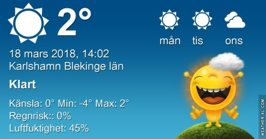

Idag går solen upp 06:09 och ned 18:09. Månen går upp 06:55 och ned 19:14 Månen är belyst 0 %. Dagens längd är 12 timmar och 0 minuter

 Klart - 8,6 C  Vindby 1,6 m/s ENE  luftfuktighet 68 %  hPa 1024 Kl.01:35

 Klart - 0,9 C  Vindby 1,4 m/s S  Luftfuktighet 52 %  hPa 1023 Kl.07:55

 Klart 8 C  ( i solen ) Vindby 2 m/s SSW  Luftfuktighet 46 %  hPa 1022 Kl.13:55

 Klart - 6,3 C  Vindstilla  Luftfuktighet 70 %  hPa 1019 Kl.19:50

 Idag har det varit soligt och fint hela dagen, äntligen.

Högst och lägst uppmätta temperatur igår (inofficiellt privat mätare): Max 4,1 C ( i solen ) , Min – 8,6 C Högst uppmätta vind 4,1 m/s. Högst uppmätta vindby 7,5 m/s.

Högst och lägst uppmätta temperatur igår (officiellt enligt [YR.NO](http://www.vackertvader.se/v%C3%A4derstation/karlshamn?utm_source=email&utm_medium=email&utm_campaign=asarum)) Max – 1,2 C, Min – 6,8 C Högst uppmätta vind 3,3 m/s. Högst uppmätta vindby 9,6 m/s

 Idag visade sig äntligen solen igen. Men eftersom jag inte hade möjlighet att gå ut och ta några bilder så får denna soluppgång från 1/9-17 representera dagens soliga väder.
