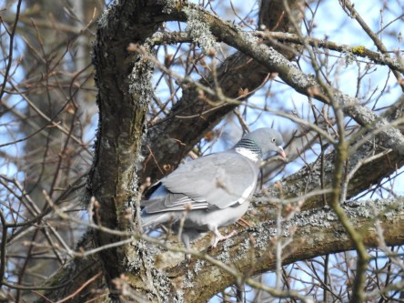
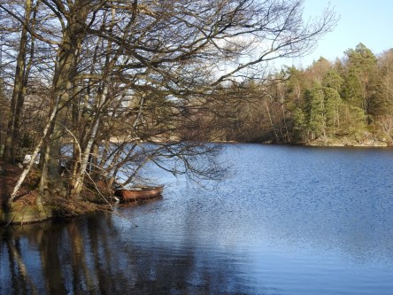
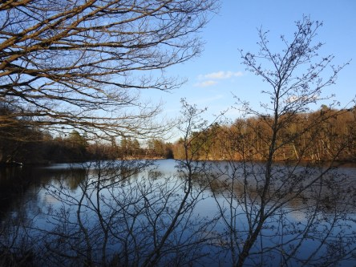

Idag går solen upp 05:48 och ned 20:13. Månen går upp 07:25 och ned 23:15 Månen är belyst 5 %. Dagens längd är 14 timmar och 25 minuter

 Mest molnigt 3,8 C  Vindstilla  Luftfuktighet 99 %  hPa 1022 Kl.02:30

 Molnigt 6,1 C  Vindstilla  Luftfuktighet 97 %  hPa 1023 Kl.06:50

 Mest molnigt 22,8 C  Vindby 5,1 m/s NW  Luftfuktighet 54 %  hPa 1023 Kl.13:35

 Tunna moln 14,5 C  Vindby 2,2 m/s NNW  Luftfuktighet 68 %  hPa 1024 Kl.19:50

 Oj vad varmt det har varit idag. Känns som högsommar.

Högst och lägst uppmätta temperatur igår (inofficiellt privat mätare): Max 17,9 C , Min 2,6 C Högst uppmätta vind 2,7 m/s. Högst uppmätta vindby 5,1 m/s.

Högst och lägst uppmätta temperatur igår (officiellt enligt [YR.NO](http://www.vackertvader.se/v%C3%A4derstation/karlshamn?utm_source=email&utm_medium=email&utm_campaign=asarum)) Max 14,4 C, Min 1,8 C Högst uppmätta vind 4,4 m/s. Högst uppmätta vindby 9,5 m/s

 Gick en lång härlig promenad idag i det fina sommarvädret.
