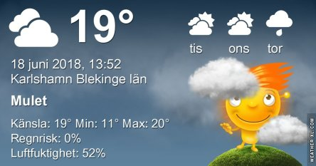

Idag går solen upp 04:12 och ned 21:52. Månen går upp 10:05 och ned 00:27 Det är gryning 03:08 och skymning 22:55 Månen är belyst 25 %. Dagens längd är 17 timmar och 40 minuter. Det är dagsljus 19 timmar och 47 minuter

 Halvklart 10,4 C  Vindby 0,3 m/s SW  Luftfuktighet 76 %  hPa 1012 Kl.01:45

 Molnigt 15,4 C  Vindby 2,8 m/s NNE  Luftfuktighet 69 %  hPa 1013 Kl.07:35

 Växlande molnighet 24,6 C  Vindby 2 m/s S  Luftfuktighet 49 %  hPa 1013 Kl.14:15

 Mest molnigt 18,8 C  Vindby 1,4 m/s SW  Luftfuktighet 65 %  hPa 1011 Kl.19:50

 Det har varit ganska behagligt idag, men också blåsigt.

Högst och lägst uppmätta temperatur igår (inofficiellt privat mätare): Max 27,1 C ( i solen ), Min 12,3 C Högst uppmätta vind 5,4 m/s. Högst uppmätta vindby 7,5 m/s

Högst och lägst uppmätta temperatur igår (officiellt enligt [YR.NO](http://www.vackertvader.se/v%C3%A4derstation/karlshamn?utm_source=email&utm_medium=email&utm_campaign=asarum)) Max 22,9 C, Min 12,5 C Högst uppmätta vind 4,1 m/s. Högst uppmätta vindby 9,6 m/s

 Nu tar jag semester från väder och vind och från bloggen. Jag är tillbaka om någon vecka igen. Ha en härlig sommar alla därute.
