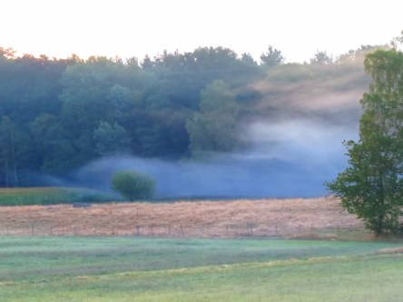
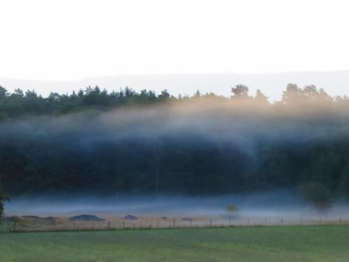
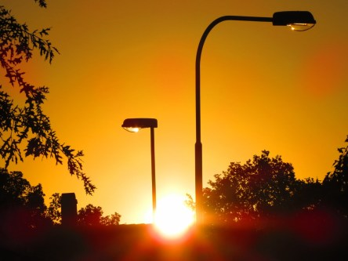

Idag går solen upp 05:36 och ned 20:32. Dagens längd är 14 timmar och 55 minuter. Det är gryning 04:53 och skymning 21:14 Det är dagsljus 16 timmar och 21 minuter. Månen går upp 14:35 och ned 23:28 Månen är belyst 48 %.

 Klart 9,5 C  Vindstilla  Luftfuktighet 98 %  hPa 1014 Kl.02:25

 Mest klart och lätt dimma 8 C  Vindstilla  Luftfuktighet 99 %  hPa 1014 Kl.06:30

 Växlande molnighet 28,6 C  Vindby 4,4 m/s SSW  Luftfuktighet 96 %  hPa 1014 Kl.13:15

 Molnigt 20,4 C  Vindby 1,4 m/s NE  Luftfuktighet 57 %  hPa 1013 Kl.20:05

 Dagen började kylig och med dimma. Det ska bli lite svalare idag. Hoppas det stämmer.

Högst och lägst uppmätta temperatur igår (inofficiellt privat mätare): Max 32,4 ( i solen ) C, Min 11,3 C Högst uppmätta vind 2 m/s. Högst uppmätta vindby 4 m/s

Högst och lägst uppmätta temperatur igår (officiellt enligt [YR.NO](http://www.vackertvader.se/v%C3%A4derstation/karlshamn?utm_source=email&utm_medium=email&utm_campaign=asarum)) Max 24,5 C, Min 11 C Högst uppmätta vind 3,2 m/s. Högst uppmätta vindby 7,7 m/s

 Dagen började med dimma...

 ... och sen blev det så här.
