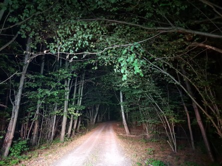
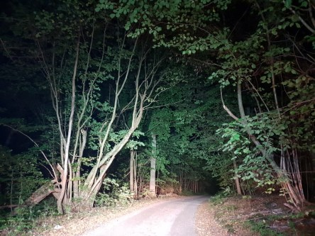
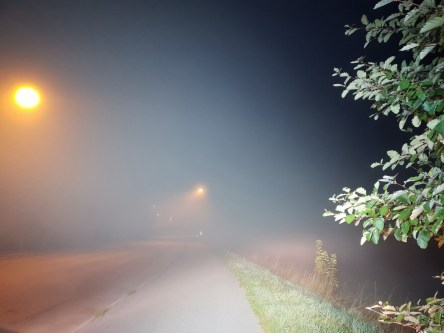

Idag går solen upp 06:38 och ned 19:11. Dagens längd är 12 timmar och 33 minuter. Det är gryning 06:00 och skymning 19:48 Det är dagsljus 13 timmar och 48 minuter. Månen går upp 16:31 och ned 23:59 Månen är belyst 51 %.

 Halvklart 10 C  Vindstilla  Luftfuktighet 97 %  hPa 1012 Kl.02:25

 Dimma 7,9 C  Vindstilla  Luftfuktighet 99 %  hPa 1011 Kl.06:30

 Mest klart 28,7 C   Vindby 2 m/s ESE  Luftfuktighet 55 %  hPa 1010 Kl.13:15

 Klart 13,3 C  Vindstilla  Luftfuktighet 89 %  hPa 1007 Kl.20:10

 Idag har det varit högsommarvärme igen!

Högst och lägst uppmätta temperatur igår (inofficiellt privat mätare): Max 23,4 C , Min 12,7 C Högst uppmätta vind 3,4 m/s. Högst uppmätta vindby 6,5 m/s

Högst och lägst uppmätta temperatur igår (officiellt enligt [YR.NO](http://www.vackertvader.se/v%C3%A4derstation/karlshamn?utm_source=email&utm_medium=email&utm_campaign=asarum)) Max 20,6 C, Min 11,2 C Högst uppmätta vind 3,2 m/s. Högst uppmätta vindby 9,6 m/s

 Nu är det mörkt på morgnarna när man kör. Och ofta dimmigt också. Ganska mysigt faktiskt.
