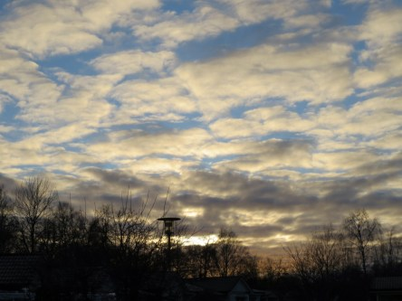

Idag går solen upp 08:18 och ned 16:04. Månen går upp 09:22 och ned 18:47 Månen är belyst 3 %. Dagens längd är 7 timmar och 46 minuter

 Mest molnigt - 0,9 C  Vindby 1 m/s E  Luftfuktighet 94 %  hPa 991 Kl.02:10

 Mest klart - 4,2 C  Vindstilla  Luftfuktighet 90 %  hPa 994 Kl.06:45

 Växlande molnighet 0 C  Vindstilla  Luftfuktighet 75 %  hPa 998 Kl.15:05

 Växlande molnighet - 3,1 C  Vindstilla  Luftfuktighet 92 %  hPa 1000 Kl.19:55

 Jag har bara ett ord för vädret just nu: Tröttsamt.

Högst och lägst uppmätta temperatur igår (inofficiellt privat mätare): Max 1,6 C , Min – 2,8 C Högst uppmätta vind 1,7 m/s. Högst uppmätta vindby 3,1 m/s.

Högst och lägst uppmätta temperatur igår (officiellt enligt [YR.NO](http://www.vackertvader.se/v%C3%A4derstation/karlshamn?utm_source=email&utm_medium=email&utm_campaign=asarum)) Max 0,6 C, Min – 2,7 C Högst uppmätta vind 2,6 m/s. Högst uppmätta vindby 4,6 m/s

 Man kunde skymta en blå himmel under en kort stund idag.
