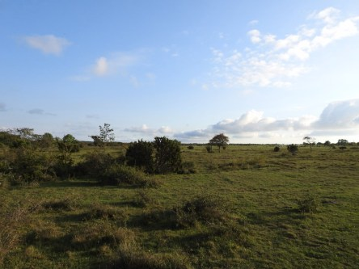

Idag går solen upp 07:18 och ned 17:12. Månen går upp 08:49 och ned 21:27 Månen är belyst 11 %. Dagens längd är 9 timmar och 54 minuter

 Molnigt - 1,9 C  Vindstilla  Luftfuktighet 86 %  hPa 1017 Kl.02:35

 Mest molnigt - 3,7 C  Vindstilla  Luftfuktighet 89 %  hPa 1016 Kl.06:35

 Mest molnigt och en del soldis 5 C  Vindby 1,7 m/s NW  Luftfuktighet 79 %  hPa 1017 Kl.13:40

 Mest klart - 2,7 C  Vindstilla  Luftfuktighet 90 %   hPa 1018 Kl.19:50

 Soldis och mest grått idag.

Högst och lägst uppmätta temperatur igår (inofficiellt privat mätare): Max 4,4 C, Min – 4,8 C Högst uppmätta vind 0,7 m/s. Högst uppmätta vindby 1,4 m/s.

Högst och lägst uppmätta temperatur igår (officiellt enligt [YR.NO](http://www.vackertvader.se/v%C3%A4derstation/karlshamn?utm_source=email&utm_medium=email&utm_campaign=asarum)) Max 2,2 C, Min – 2,7 C Högst uppmätta vind 1,8 m/s. Högst uppmätta vindby 3,9 m/s

 Sommarminnen från Öland.
