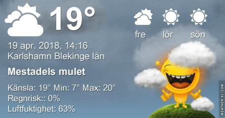
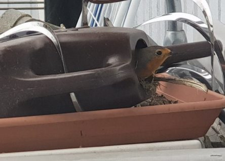

Idag går solen upp 05:45 och ned 20:15. Månen går upp 07:57 och ned 00:32 Månen är belyst 11 %. Dagens längd är 14 timmar och 30 minuter

 Mest klart 6,3 C  Vindstilla  Luftfuktighet 99 %  hPa 1026 Kl.02:25

 Molnigt 9 C  Vindby 0,6 m/s S  Luftfuktighet 99 %  hPa 1026 Kl.06:45

 Växlande molnighet 24,5 C  Vindby 4 m/s ENE  Luftfuktighet 65 %  hPa 1027 Kl.12:30

 Klart 9,3 C  Vindstilla  Luftfuktighet 82 %  hPa 1024 Kl.20:55

 Ännu en solig varm och fin dag.

Högst och lägst uppmätta temperatur igår (inofficiellt privat mätare): Max 24,5 C , Min 3,7 C Högst uppmätta vind 4,1 m/s. Högst uppmätta vindby 8,2 m/s.

Högst och lägst uppmätta temperatur igår (officiellt enligt [YR.NO](http://www.vackertvader.se/v%C3%A4derstation/karlshamn?utm_source=email&utm_medium=email&utm_campaign=asarum)) Max 19,8 C, Min 4,2 C Högst uppmätta vind 4,7 m/s. Högst uppmätta vindby 10,5 m/s

 Härliga vårblommor från gårdagens promenad.

 

 Och sist men absolut inte minst så upptäckte jag att en liten rödhake håller på att bygga bo i min vattenkanna på altanen. Det blir till att hitta på andra sätt att vattna blommorna nu.
