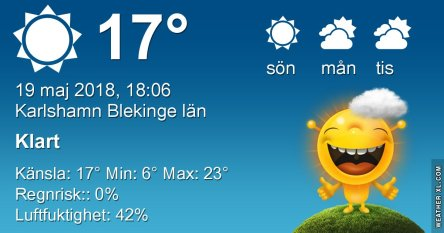
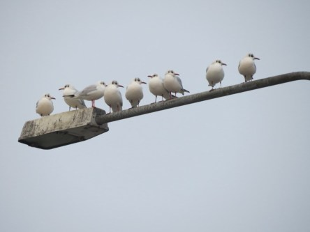
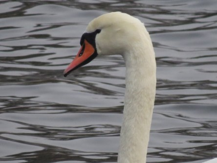
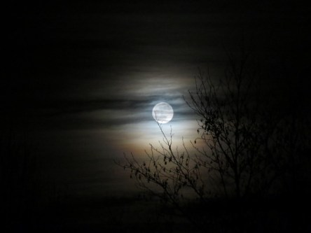
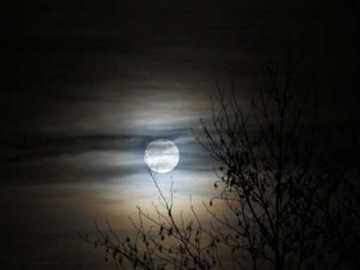

Idag går solen upp 04:40 och ned 21:14. Månen går upp 08:25 och ned 01:25 Månen är belyst 17 %. Dagens längd är 16 timmar och 34 minuter

 Växlande molnighet 8,6 C  Vindstilla  Luftfuktighet 83 %  hPa 1017 Kl.02:00

 Växlande molnighet 16,5 C  Vindby 0,3 m/s N  Luftfuktighet 58 %  hPa 1018 Kl.07:15

 Mest klart 25,3 C  Vindby 2,8 m/s WSW  Luftfuktighet 22 %  hPa 1019 Kl.14:25

 Mest klart 13,9 C  Vindby 1,8 m/s WSW  Luftfuktighet 59 %  hPa 1020 Kl.19:50

 Lagom varm dag idag.

Högst och lägst uppmätta temperatur igår (inofficiellt privat mätare): Max 30,6 C ( i solen) , Min 6 C Högst uppmätta vind 2 m/s. Högst uppmätta vindby 4,4 m/s.

Högst och lägst uppmätta temperatur igår (officiellt enligt [YR.NO](http://www.vackertvader.se/v%C3%A4derstation/karlshamn?utm_source=email&utm_medium=email&utm_campaign=asarum)) Max 20,9 C, Min 5,9 C Högst uppmätta vind 3,3 m/s. Högst uppmätta vindby 7,3 m/s

 Återigen fick arkivet rycka in med lite äldre fågelbilder.

 Och ett par stämningsfulla månbilder.
