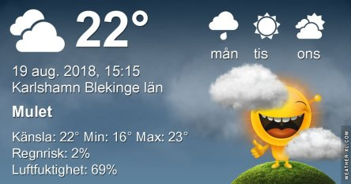
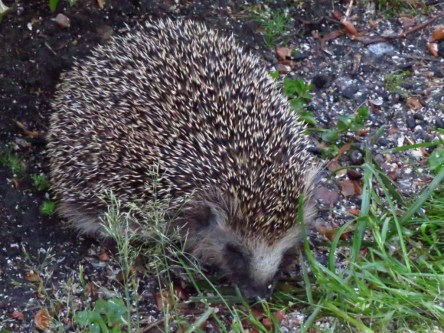

Idag går solen upp 05:38 och ned 20:29. Dagens längd är 14 timmar och 51 minuter. Det är gryning 04:56 och skymning 21:11 Det är dagsljus 16 timmar och 15 minuter. Månen går upp 14:44 och ned 23:56 Månen är belyst 57 %.

 Molnigt 17,9 C  Vindby 3,6 m/s NNE  Luftfuktighet 73 %  hPa 1012 Kl.01:35

 Molnigt 17,3 C  Vindby 2,7 m/s SE  Luftfuktighet 81 %  hPa 1013 Kl.06:55

 Molnigt 25,3 C  Vindby 3,4 m/s E  Luftfuktighet 68 %  hPa 1013 Kl.13:30

 Molnigt 18,8 C  Vindby 1,4 m/s SW  Luftfuktighet 76 %  hPa 1011 Kl.20:00

 Äntligen en molnig och svalare dag!

Högst och lägst uppmätta temperatur igår (inofficiellt privat mätare): Max 28,3 ( i solen ) C, Min 7,7 C Högst uppmätta vind 3,1 m/s. Högst uppmätta vindby 5,8 m/s

Högst och lägst uppmätta temperatur igår (officiellt enligt [YR.NO](http://www.vackertvader.se/v%C3%A4derstation/karlshamn?utm_source=email&utm_medium=email&utm_campaign=asarum)) Max 23,3 C, Min 7,6 C Högst uppmätta vind 3,9 m/s. Högst uppmätta vindby 8,8 m/s

 För några år sedan hade vi alltid besök av flera igelkottar i trädgården. De kom hit och åt varje natt. Men jag har inte sett dem på väldigt länge nu. Jag saknar verkligen mina små taggiga vänner och hoppas att de kommer tillbaka igen snart.
