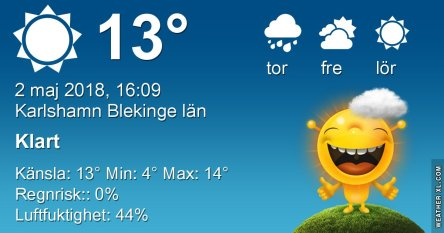
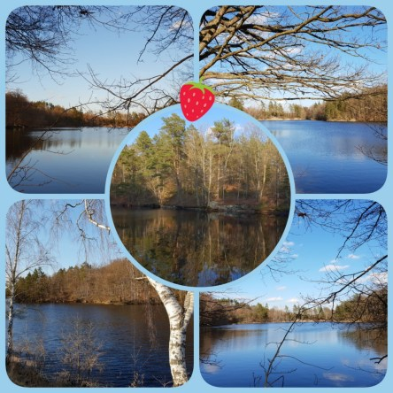

Idag går solen upp 05:14 och ned 20:41. Månen går upp 23:18 och ned 06:54 Månen är belyst 96 %. Dagens längd är 15 timmar och 27 minuter

 Växlande molnighet 5,8 C  Vindby 2,7 m/s N  Luftfuktighet 92 %  hPa 1004 Kl.01:20

 Växlande molnighet 8,9 C  Vindby 0,7 m/s S  Luftfuktighet 91 %  hPa 1007 Kl.07:30

 Tunna slöjmoln 18,3 C  Vindby 5,6 m/s W  Luftfuktighet 54 %  hPa 1012 Kl.14:05

 Tunna slöjmoln 9 C  Vindby 2 m/s SW  Luftfuktighet 59 %  hPa 1011 Kl.19:55

 Solig och fin dag. Men blåsigt igen.

Högst och lägst uppmätta temperatur igår (inofficiellt privat mätare): Max 19 C , Min 2,5 C Högst uppmätta vind 4,1 m/s. Högst uppmätta vindby 8,5 m/s.

Högst och lägst uppmätta temperatur igår (officiellt enligt [YR.NO](http://www.vackertvader.se/v%C3%A4derstation/karlshamn?utm_source=email&utm_medium=email&utm_campaign=asarum)) Max 13,2 C, Min 2,3 C Högst uppmätta vind 3,9 m/s. Högst uppmätta vindby 9,8 m/s

 Idag har jag lekt med mina bilder för att ha något att göra.
