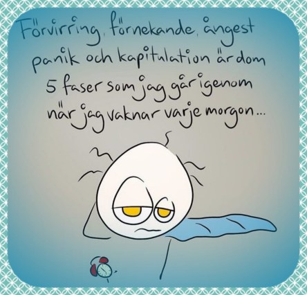

Idag går solen upp 07:10 och ned 16:17. Dagens längd är 9 timmar och 07 minuter. Det är gryning 06:30 och skymning 16:58 Det är dagsljus 10 timmar och 28 minuter. Månen går upp 23:38 och ned 15:00 Månen är belyst 34 %.

 Halvklart 6,1 C  Vindby 0,3 m/s S  Luftfuktighet 88 %  hPa 1007 Kl.01:55

 Molnigt 5,3 C  Vindby 0,7 m/s W  Luftfuktighet 94 %  hPa 1009 Kl.06:40

 Mest molnigt 12,5 C  Vindby 2 m/s SSW  Luftfuktighet 69 %  hPa 1013 Kl.14:25

 Mest molnigt 9,1 C  Vindby 2 m/s NE  Luftfuktighet 82 %  hPa 1016 Kl.20:10

 Grått och duggregn även idag. Men milt och skönt.

Högst och lägst uppmätta temperatur igår (inofficiellt privat mätare): Max 14,3 C , Min 2,4 C Högst uppmätta vind 2,4 m/s, Högst uppmätta vindby 4,4 m/s

Högst och lägst uppmätta temperatur igår (officiellt enligt [YR.NO](http://www.vackertvader.se/v%C3%A4derstation/karlshamn?utm_source=email&utm_medium=email&utm_campaign=asarum)) Max 12,1 C, Min - 0,1 C Högst uppmätta vind 3,3 m/s. Högst uppmätta vindby 8,5 m/s

 Veckodagarna ser ut och känns ungefär så här.

 Till skillnad från helgen. Och en extra ledig natt dessutom den här gången!

 Nu är det det här som gäller!

