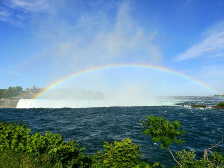
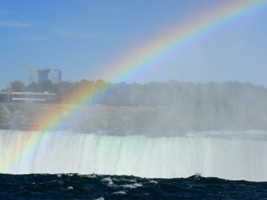
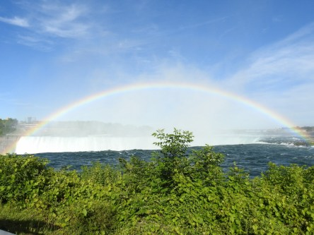

Idag går solen upp 04:18 och ned 21:51. Dagens längd är 17 timmar och 33 minuter. Det är gryning 03:16 och skymning 22:52 Det är dagsljus 19 timmar och 36 minuter. Månen går upp 23:57 och ned 08:35 Månen är belyst 97 %.

 Mest klart 7 C  Vindstilla  Luftfuktighet 93 %  hPa 1017 Kl.01:45

 En del moln 19,3 C  Vindby 1 m/s NE  Luftfuktighet 54 %  hPa 1014 Kl.07:40

 Ökande molntäcke 29,7 C  Vindby 2,4 m/s SSE  Luftfuktighet 25 %  hPa 1012 Kl.13:10

 Växlande molnighet 18,7 C  Vindby 2 m/s E  Luftfuktighet 65 %  hPa 1010 Kl.20:05

 Jag vill ha regn! På tre månader har det bara kommit 38 mm här!

Högst och lägst uppmätta temperatur igår (inofficiellt privat mätare): Max 25,2 C ( i solen ), Min 5,6 C Högst uppmätta vind 4,4 m/s. Högst uppmätta vindby 5,8 m/s

Högst och lägst uppmätta temperatur igår (officiellt enligt [YR.NO](http://www.vackertvader.se/v%C3%A4derstation/karlshamn?utm_source=email&utm_medium=email&utm_campaign=asarum)) Max 20,9 C, Min 4,5 C Högst uppmätta vind 4,1 m/s. Högst uppmätta vindby 10,1 m/s

 Regnbåge över Hästskofallen, Niagarafallen i Ontario Kanada. Det här var helt otroligt att uppleva. Det går inte att beskriva hur vackert detta är. Man blir helt mållös när man ser detta i verkligheten. När man står vid fallen  och det blåser in mot land så blir man lika blöt som när det regnar. Helt otrolig känsla!
