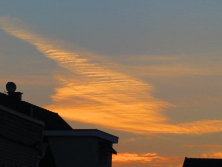
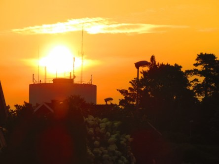

Idag går solen upp 05:05 och ned 21:07. Dagens längd är 16 timmar och 02 minuter. Det är gryning 04:16 och skymning 21:56 Det är dagsljus 17 timmar och 40 minuter. Månen går upp 23:22 och ned 11:02 Månen är belyst 76 %.

 Klart 20,3 C  Vindby 1,4 m/s NE  Luftfuktighet 89 %  hPa 1015 Kl.01:50

 Tunna moln 19,7 C  Vindby 1,2 m/s ESE  Luftfuktighet 81 %  hPa 1017 Kl.06:40

 Mest molnigt 34,5 C  Vindby 2,4 m/s SSW  Luftfuktighet 24 %  hPa 1017 Kl.14:55

 Halvklart 26,7 C  Vindby 1,4 m/s SW  Luftfuktighet 31 %  hPa 1016 Kl.19:50

 Återigen visar termometern över 30 grader!

Högst och lägst uppmätta temperatur igår (inofficiellt privat mätare): Max 39.9 C ( i solen ), Min 19,5 C Högst uppmätta vind 3,4 m/s. Högst uppmätta vindby 8,8 m/s

Högst och lägst uppmätta temperatur igår (officiellt enligt [YR.NO](http://www.vackertvader.se/v%C3%A4derstation/karlshamn?utm_source=email&utm_medium=email&utm_campaign=asarum)) Max 31,5 C, Min 19,1 C Högst uppmätta vind 3,3 m/s. Högst uppmätta vindby 7,5 m/s

 Kan det vara besök från yttre rymden här?

 Fler mystiska moln.

 Och så börjar gassandet igen.

 Men idag fick hon gå en fajt mot mörka moln.
