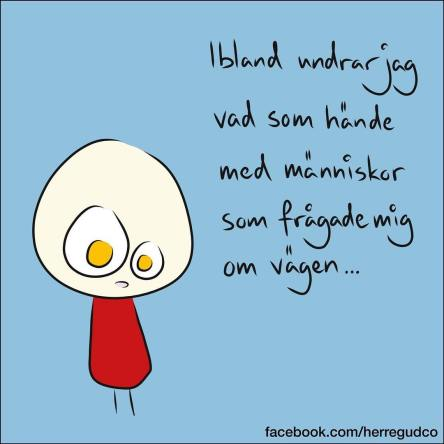

Idag går solen upp 07:42 och ned 17:48. Dagens längd är 10 timmar och 06 minuter. Det är gryning 07:04 och skymning 18:26 Det är dagsljus 11 timmar och 22 minuter. Månen går upp 17:04 och ned 01:59 Månen är belyst 80 %.

 Molnigt2,1 C  Vindstilla  Luftfuktighet 97 %  hPa 1019 Kl.02:25

 Växlande molnighet 3,8 C  Vindstilla  Luftfuktighet 98 %  hPa 1019 Kl.06:40

 Växlande molnighet 15,2 C  Vindby 2 m/s SSE  Luftfuktighet 69 %  hPa 1020 Kl.13:05

 Klart 5,8 C  Vindstilla  Luftfuktighet 93 %  hPa 1021 Kl.20:25

 Det kom några droppar från himlen idag men det var inte ens mätbart.

Högst och lägst uppmätta temperatur igår (inofficiellt privat mätare): Max 18,1 C , Min - 3,3 C Högst uppmätta vind 1,4 m/s, Högst uppmätta vindby 2,4 m/s

Högst och lägst uppmätta temperatur igår (officiellt enligt [YR.NO](http://www.vackertvader.se/v%C3%A4derstation/karlshamn?utm_source=email&utm_medium=email&utm_campaign=asarum)) Max 12 C, Min - 3,3 C Högst uppmätta vind 2,7 m/s. Högst uppmätta vindby 5,7 m/s

 Kloka ord tills jag orkar få fram kameran igen!
