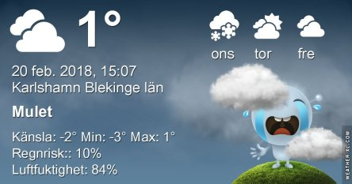
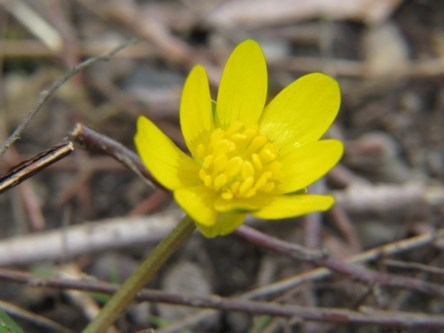
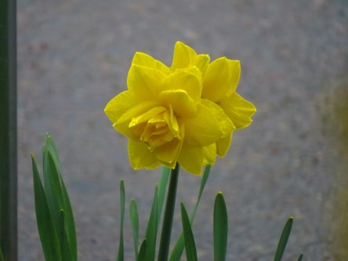
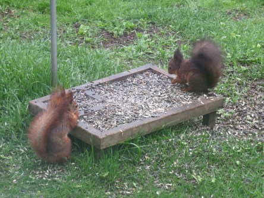

Idag går solen upp 07:15 och ned 17:14. Månen går upp 09:08 och ned 22:44 Månen är belyst 17 %. Dagens längd är 9 timmar och 59 minuter

 Växlande molnighet - 3,5 C  Vindby 1 m/s NW  Luftfuktighet 92 %  hPa 1019 Kl.02:20

 Dimma - 1,7 C  Vindby 0,6 m/s WNW  Luftfuktighet 98 %  hPa 1019 Kl.06:50

 Molnigt 2,6 C  Vindby 1,8 m/s NNW  Luftfuktighet 80 %  hPa 1021 Kl.14:00

 Mest molnigt - 1,1 C  Vindby 0,7 m/s W  Luftfuktighet 81 %  hPa 1022 Kl.20:50

 Kallt, kallt och åter kallt är allt man ser på prognoserna nu.

Högst och lägst uppmätta temperatur igår (inofficiellt privat mätare): Max 5,9 C, Min – 4,2 C Högst uppmätta vind 1,7 m/s. Högst uppmätta vindby 2,7 m/s.

Högst och lägst uppmätta temperatur igår (officiellt enligt [YR.NO](http://www.vackertvader.se/v%C3%A4derstation/karlshamn?utm_source=email&utm_medium=email&utm_campaign=asarum)) Max 3 C, Min – 4,1 C Högst uppmätta vind 2,3 m/s. Högst uppmätta vindby 5 m/s

 I brist på roliga motiv just nu så får det bli några äldre bilder på vårblommor i trädgården.

 Och en bild på mina små vänner ekorrarna.
