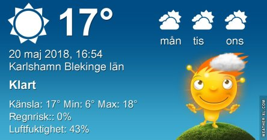
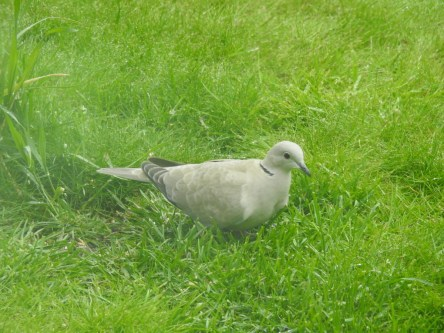

Idag går solen upp 04:38 och ned 21:16. Månen går upp 09:38 och ned 01:24 Månen är belyst 27 %. Dagens längd är 16 timmar och 38 minuter

 Klart 4,6 C  Vindstilla  Luftfuktighet 93 %  hPa 1021 Kl.01:30

 Klart 15,5 C  Vindby 0,8 m/s NE  Luftfuktighet 64 %  hPa 1022 Kl.07:30

 Halvklart 24,1 C  Vindby 4,4 m/s S  Luftfuktighet 42 %  hPa 1025 Kl.14:00

 Halvklart 13,6 C  Vindby 0,7 m/s NW  Luftfuktighet 47 %  hPa 1024 Kl.19:50

 Idag har det fläktat lite och varit lagom varmt.

Högst och lägst uppmätta temperatur igår (inofficiellt privat mätare): Max 25,1 C ( i solen) , Min 6,4 C Högst uppmätta vind 2,7 m/s. Högst uppmätta vindby 9,6 m/s.

Högst och lägst uppmätta temperatur igår (officiellt enligt [YR.NO](http://www.vackertvader.se/v%C3%A4derstation/karlshamn?utm_source=email&utm_medium=email&utm_campaign=asarum)) Max 20,1 C, Min 4,6 C Högst uppmätta vind 3,7 m/s. Högst uppmätta vindby 9,4 m/s

 Gäster i trädgården för ett år sedan.
