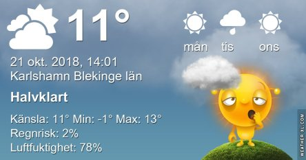

Idag går solen upp 07:44 och ned 17:45. Dagens längd är 10 timmar och 01 minuter. Det är gryning 07:06 och skymning 18:23 Det är dagsljus 11 timmar och 17 minuter. Månen går upp 17:21 och ned 03:10 Månen är belyst 86 %.

 Klart 0,5 C  Vindstilla  Luftfuktighet 93 %  hPa 1021 Kl.01:15

 Ökande molnighet 1,2 C  Vindstilla  Luftfuktighet 94 %  hPa 1022 Kl.07:55

 Molnigt 14,6 C  Vindby 2 m/s SE  Luftfuktighet 71 %  hPa 1021 Kl.13:55

 Mest molnigt 10,3 C  Vindby 2,6 m/s SSW  Luftfuktighet 82 %  hPa 1018 Kl.19:50

 Nu är det slut på värmen och det blir mörkare och kallare för varje dag. Och snart är det dags för den hopplösa klockomställningen. Men förhoppningsvis blir det bara en till efter det! För nu verkar det som att det är bestämt att vi ska sluta med eländet! Jippi!

Högst och lägst uppmätta temperatur igår (inofficiellt privat mätare): Max 17,7 C , Min 0,7 C Högst uppmätta vind 1,7 m/s, Högst uppmätta vindby 3,4 m/s

Högst och lägst uppmätta temperatur igår (officiellt enligt [YR.NO](http://www.vackertvader.se/v%C3%A4derstation/karlshamn?utm_source=email&utm_medium=email&utm_campaign=asarum)) Max 12,3 C, Min – 0,9 C Högst uppmätta vind 2,2 m/s. Högst uppmätta vindby 4,9 m/s

 Ibland är det bra med ett stort arkiv och många roliga appar att leka med.
