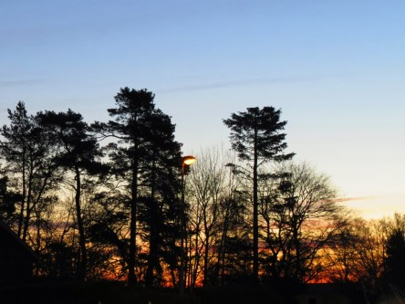

Idag går solen upp 06:01 och ned 18:15. Månen går upp 07:56 och ned 23:10 Månen är belyst 14 %. Dagens längd är 12 timmar och 14 minuter

 Klart - 9,2 C  Vindstilla  Luftfuktighet 82 %  hPa 1018 Kl.01:50

 Slöjmoln - 9,9 C  Vindstilla  Luftfuktighet 78 %  hPa 1017 Kl.06:30

 Växlande molnighet 9,7 C  Vindby 2,4 m/s NNW  Luftfuktighet 38 %  hPa 1015 Kl.13:25

 Mest molnigt 1,2 C  Vindby 3 m/s NNW  Luftfuktighet 82 %  hPa 1011 Kl.19:50

 En del sol men kallt och blåsigt.

Högst och lägst uppmätta temperatur igår (inofficiellt privat mätare): Max 11,4 C ( i solen ) , Min – 5,7 C Högst uppmätta vind 3,4 m/s. Högst uppmätta vindby 7,1 m/s.

Högst och lägst uppmätta temperatur igår (officiellt enligt [YR.NO](http://www.vackertvader.se/v%C3%A4derstation/karlshamn?utm_source=email&utm_medium=email&utm_campaign=asarum)) Max 5 C, Min – 6,2 C Högst uppmätta vind 4,9 m/s. Högst uppmätta vindby 11 m/s

 Ännu en härlig soluppgång idag men stora färgskiftningar. Helt oredigerade den här gången.
