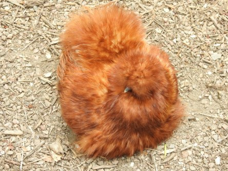
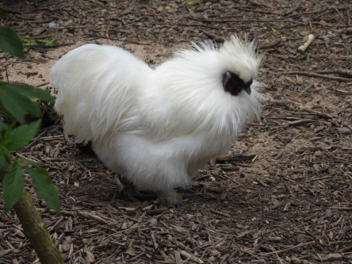
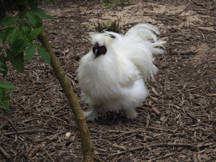
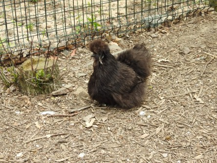

Idag går solen upp 04:36 och ned 21:18. Månen går upp 10:57 och ned 02:03 Månen är belyst 38 %. Dagens längd är 16 timmar och 42 minuter

 Klart 2,6 C  Vindstilla  Luftfuktighet 99 %  hPa 1024 Kl.01:30

 Tunna slöjmoln 12,4 C  Vindstilla  Luftfuktighet 85 %  hPa 1024 Kl.07:30

 Tunna slöjmoln 27,7 C  Vindby 6,2 m/s SSE  Luftfuktighet 37 %  hPa 1022 Kl.14:20

 Mest molnigt 17,8 C  Vindby 1,4 m/s NW  Luftfuktighet 50 %  hPa 1020 Kl.19:50

 ännu en solig och varm dag. Det är väldigt torrt och stor brandrisk i skog och mark just nu. Det behövs regn i massor.

Högst och lägst uppmätta temperatur igår (inofficiellt privat mätare): Max 27,6 C ( i solen) , Min 3,1 C Högst uppmätta vind 2,4 m/s. Högst uppmätta vindby 4,1 m/s.

Högst och lägst uppmätta temperatur igår (officiellt enligt [YR.NO](http://www.vackertvader.se/v%C3%A4derstation/karlshamn?utm_source=email&utm_medium=email&utm_campaign=asarum)) Max 17,5 C, Min 2,6 C Högst uppmätta vind 4,7 m/s. Högst uppmätta vindby 8,4 m/s

 Ett gäng lurviga silkeshöns i Helsingborgs djurpark.
