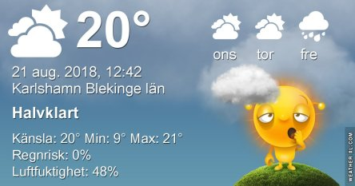

Idag går solen upp 05:42 och ned 20:24. Dagens längd är 14 timmar och 42 minuter. Det är gryning 05:00 och skymning 21:06 Det är dagsljus 16 timmar och 06 minuter. Månen går upp 17:46 och ned 00:31 Månen är belyst 76 %.

 Mest klart 10,4 C  Vindby 1 m/s W  Luftfuktighet 88 %   hPa 1011 Kl.02:20

 Växlande molnighet 8,5 C  Vindstilla  Luftfuktighet 99 %  hPa 1014 Kl.07:00

 Växlande molnighet 27,5 C  Vindby 3,6 m/s NNW  Luftfuktighet 38 %  hPa 1016 Kl.13:35

 Växlande molnighet 13,6 C  Vindstilla  Luftfuktighet 78 %   hPa 1016 Kl.21:00

 Det började med en härligt frisk och kylig morgon och slutade med sol och varmt igen.

Högst och lägst uppmätta temperatur igår (inofficiellt privat mätare): Max 27,4 C ( i solen ), Min 10,5 C Högst uppmätta vind 3,4 m/s. Högst uppmätta vindby 7,1 m/s

Högst och lägst uppmätta temperatur igår (officiellt enligt [YR.NO](http://www.vackertvader.se/v%C3%A4derstation/karlshamn?utm_source=email&utm_medium=email&utm_campaign=asarum)) Max 23,3 C, Min 11,7 C Högst uppmätta vind 4,5 m/s. Högst uppmätta vindby 12,8 m/s

 Och så blev det ännu en varm dag trots att natten var kylig.
