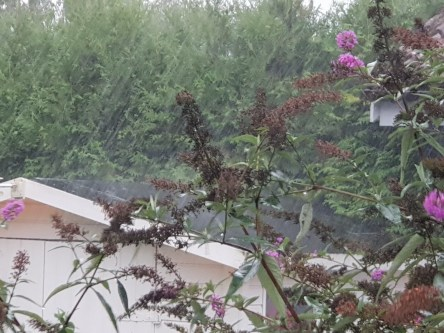
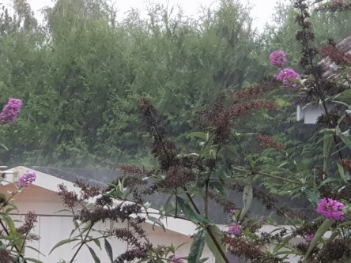
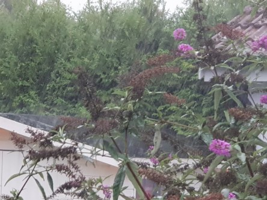
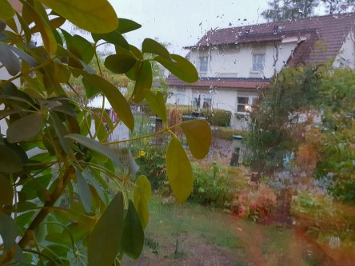

Idag går solen upp 06:43 och ned 19:03. Dagens längd är 12 timmar och 20 minuter. Det är gryning 06:06 och skymning 19:40 Det är dagsljus 13 timmar och 34 minuter. Månen går upp 18:16 och ned 02:00 Månen är belyst 85 %.

 Växlande molnighet 13,4 C  Vindby 0,3 m/s W  Luftfuktighet 94 %  hPa 1006 Kl.02:05

 Mest molnigt 14 C  Vindby 1,4 m/s SSE  Luftfuktighet 97 %  hPa 1002 Kl.07:00

 Blåsigt och växlande molnighet 23,1 C  Vindby 5,2 m/s NE  Luftfuktighet 63 %  hPa 996 Kl.14:45

 Molnigt 11,2 C  Vindstilla  Luftfuktighet 97 %  hPa 994  Regn 6,7 mm Kl.19:45

 Det blev rejält blåsigt och kom en skur ikväll. Men det gick över allt för snabbt. Får se om det kommer mer senare.

Högst och lägst uppmätta temperatur igår (inofficiellt privat mätare): Max 25,1 C ( i solen ), Min 11,4 C Högst uppmätta vind 3,4 m/s. Högst uppmätta vindby 5,4 m/s

Högst och lägst uppmätta temperatur igår (officiellt enligt [YR.NO](http://www.vackertvader.se/v%C3%A4derstation/karlshamn?utm_source=email&utm_medium=email&utm_campaign=asarum)) Max 20,9 C, Min 11 C Högst uppmätta vind 3,2 m/s. Högst uppmätta vindby 8 m/s

 Det kom en kort men intensiv regnskur och blåste ordentligt.

 Och så några kloka ord som avslutning idag.
