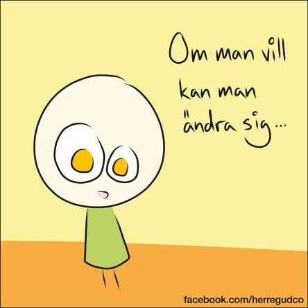
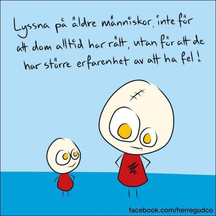

Idag går solen upp 07:47 och ned 17:43. Dagens längd är 9 timmar och 56 minuter. Det är gryning 07:08 och skymning 18:21 Det är dagsljus 11 timmar och 13 minuter. Månen går upp 17:38 och ned 04:20 Månen är belyst 93 %.

 Molnigt 11,4 C  Vindby 2,8 m/s ESE  Luftfuktighet 92 %  hPa 1015 Kl.02:00

 Molnigt 9,9 C  Vindby 3,4 m/s S  Luftfuktighet 81 %  hPa 1015 Kl.02:25

 Växlande molnighet och blåsigt 15,9 C  Vindby 5,2 m/s SSW  Luftfuktighet 37 %  hPa 1016 Kl.13:40

 Halvklart 4,9 C  Vindby 1,7 m/s E  Luftfuktighet 70 %  hPa 1017 Kl.20:10

 En härligt varm natt och en blåsig dag. Men nu sjunker tempen.

Högst och lägst uppmätta temperatur igår (inofficiellt privat mätare): Max 14,6 C , Min - 1,2 C Högst uppmätta vind 3,1 m/s, Högst uppmätta vindby 5,6 m/s

Högst och lägst uppmätta temperatur igår (officiellt enligt [YR.NO](http://www.vackertvader.se/v%C3%A4derstation/karlshamn?utm_source=email&utm_medium=email&utm_campaign=asarum)) Max 12,3 C, Min – 1,9 C Högst uppmätta vind 2 m/s. Högst uppmätta vindby 4,9 m/s

 Kloka ord som är beroendeframkallande!
