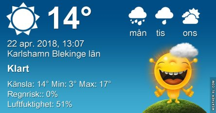

Idag går solen upp 05:38 och ned 20:21. Månen går upp 10:37 och ned 02:38 Månen är belyst 41 %. Dagens längd är 14 timmar och 43 minuter

 Klart 3,8 C  Vindby 0,8 m/s S  Luftfuktighet 83 %  hPa 1012 Kl.01:30

 Halvklart 8,6 C  Vindby 3,7 m/s SE  Luftfuktighet 72 %  hPa 1011 Kl.08:20

 Mest molnigt 24,4 C  Vindby 3,4 m/s E  Luftfuktighet 39 %  hPa 1011 Kl.13:20

 Tunna moln 6,7 C  Vindby 1,2 m/s E  Luftfuktighet 79 %  hPa 1011 Kl.19:50

 Ännu en härlig, varm sommardag att njuta av. Men imorgon slår det om och blir kallare och regn. Konstigt nog så behövs faktiskt regnet eftersom det trots vintern är snustorrt i gräset.

Högst och lägst uppmätta temperatur igår (inofficiellt privat mätare): Max 25,1 C , Min 5,7 C Högst uppmätta vind 6,1 m/s. Högst uppmätta vindby 9,6 m/s.

Högst och lägst uppmätta temperatur igår (officiellt enligt [YR.NO](http://www.vackertvader.se/v%C3%A4derstation/karlshamn?utm_source=email&utm_medium=email&utm_campaign=asarum)) Max 18,4 C, Min 6,2 C Högst uppmätta vind 4,5 m/s. Högst uppmätta vindby 11,6 m/s

 

 Idag gjorde Turkish Airlines alias turkduvan en lyckad landning i trädgården 😄😉
