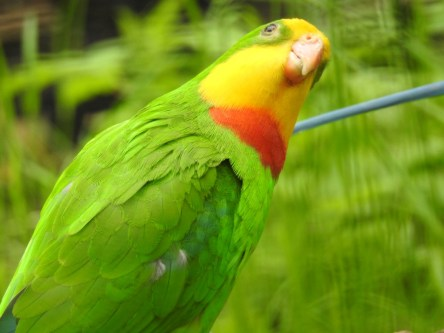
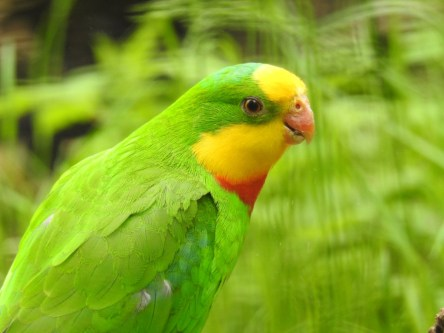
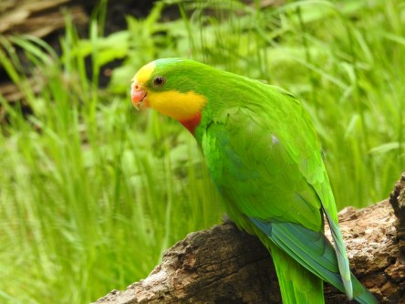

Idag går solen upp 04:35 och ned 21:20. Månen går upp 12:18 och ned 02:32 Månen är belyst 49 %. Dagens längd är 16 timmar och 45 minuter

 Mest klart 7,2 C  Vindby 1 m/s ESE  Luftfuktighet 76 %  hPa 1018 Kl.01:30

 Mest molnigt 15 C  Vindby 1 m/s W  Luftfuktighet 65 %  hPa 1014 Kl.07:30

 Molnigt 24,7 C  Vindby 3,6 m/s E  Luftfuktighet 49 %  hPa 1014 Kl.13:25

 Tunna slöjmoln 12,7 C  Vindstilla  Luftfuktighet 66 %  hPa 1014 Kl.21:00

 Idag har det varit mest molnigt men på kvällen lite mindre moln.

Högst och lägst uppmätta temperatur igår (inofficiellt privat mätare): Max 31,1 C ( i solen) , Min 2,1 C Högst uppmätta vind 2 m/s. Högst uppmätta vindby 6,2 m/s.

Högst och lägst uppmätta temperatur igår (officiellt enligt [YR.NO](http://www.vackertvader.se/v%C3%A4derstation/karlshamn?utm_source=email&utm_medium=email&utm_campaign=asarum)) Max 20,6 C, Min 2 C Högst uppmätta vind 4,4 m/s. Högst uppmätta vindby 8,3 m/s

 Någon sorts parakiter i Helsingborgs djurpark. Den översta är en Barrabandparakit har jag fått fram. Den nedersta undersöker jag vidare.
