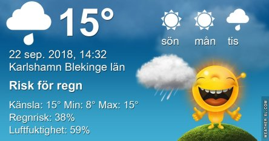
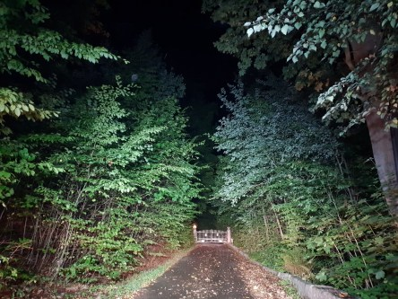
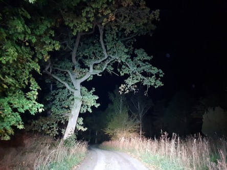
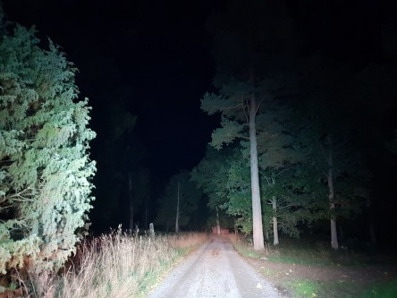
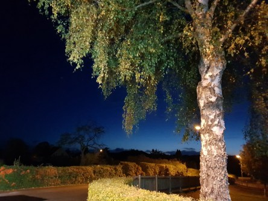

Idag går solen upp 06:44 och ned 19:00. Dagens längd är 12 timmar och 15 minuter. Det är gryning 06:08 och skymning 19:37 Det är dagsljus 13 timmar och 29 minuter. Månen går upp 18:39 och ned 03:07 Månen är belyst 91 %.

 Växlande molnighet  och regnskurar 10,2 C  Vindby 5,4 m/s E  Luftfuktighet 78 %  hPa 998 Kl.02:40

 Mest molnigt 8,5 C  Vindby 3,8 m/s SSW   Luftfuktighet 75 %  hPa 1000 Kl.06:40

 Regnskurar 14,4 C  Vindby 4,2 m/s SSE  Luftfuktighet 1004 Regn 1,5 mm Kl.13:35

 Växlande molnighet 9,3 C  Vindstilla  Luftfuktighet 82 %  hPa 1001  Regn 3,2 mm Kl.20:00

 Äntligen lite regn!

Högst och lägst uppmätta temperatur igår (inofficiellt privat mätare): Max 23,3 C ( i solen ), Min 10,8 C Högst uppmätta vind 6,5 m/s. Högst uppmätta vindby 10,5 m/s

Högst och lägst uppmätta temperatur igår (officiellt enligt [YR.NO](http://www.vackertvader.se/v%C3%A4derstation/karlshamn?utm_source=email&utm_medium=email&utm_campaign=asarum)) Max 19,9 C, Min 10,2 C Högst uppmätta vind 5,2 m/s. Högst uppmätta vindby 16,7 m/s

 Nu är det verkligen mörkt och höstlikt på morgnarna när jag jobbar. Hösten kom väldigt plötsligt känns det som.
