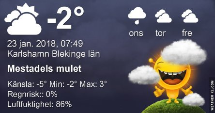
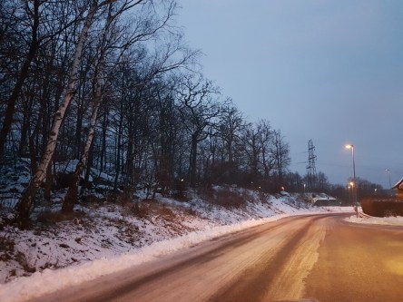

Idag går solen upp 08:12 och ned 16:12. Månen går upp 10:42 och ned 23:37 Månen är belyst 31 %. Dagens längd är 8 timmar och 0 minuter

 Molnigt - 1,3 C  Vindby 0,7 m/s S  Luftfuktighet 85 %  hPa 1013 Kl.02:05

 Molnigt - 2,1 C  Vindstilla  Luftfuktighet 89 %  hPa 1015 Kl.07:20

 Molnigt 1,2 C  Vindby 2,6 m/s W  Luftfuktighet 77 %  hPA 1015 Kl.14:55

 Molnigt och blåsigt 1,2 C  Vindby 5,8 m/s NW  Luftfuktighet 94 %  hPa 1011 Kl.21:05

 Äntligen blir det varmare igen!!!

Högst och lägst uppmätta temperatur igår (inofficiellt privat mätare): Max 2,4 C , Min – 1,6 C Högst uppmätta vind 1,4 m/s. Högst uppmätta vindby 2,4 m/s.

Högst och lägst uppmätta temperatur igår (officiellt enligt [YR.NO](http://www.vackertvader.se/v%C3%A4derstation/karlshamn?utm_source=email&utm_medium=email&utm_campaign=asarum)) Max 0,5 C, Min – 3,6 C Högst uppmätta vind 2,8 m/s. Högst uppmätta vindby 5,4 m/s

 Sista resterna av snön smälter sakta bort nu.
