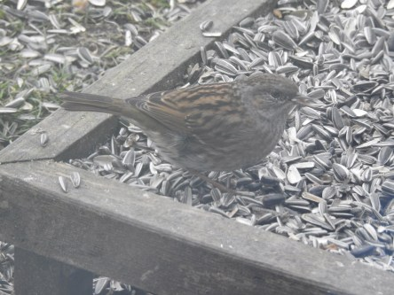

Idag går solen upp 07:08 och ned 17:20. Månen går upp 10:22 och ned 01:20 Månen är belyst 47 %. Dagens längd är 10 timmar och 12 minuter

 Växlande molnighet - 5 C  Vindstilla  Luftfuktighet 77 %  hPa 1024 Kl.01:55

 Tunna moln - 10,2 C  Vindstilla  Luftfuktighet 82 %  hPa 1023 Kl.06:55

 Molnigt 2,4 C  Vindby 3,5 m/s SW  Luftfuktighet 71 %  hPa 1023 Kl.13:30

 Molnigt - 2,3 C  Vindby 1,2 m/s S  Luftfuktighet 80 %  hPa 1025 Kl.20:00

 Jag gillar inte tanken på kyla så långt ögat når.

Högst och lägst uppmätta temperatur igår (inofficiellt privat mätare): Max 2,6 C, Min – 7 C Högst uppmätta vind 2,4 m/s. Högst uppmätta vindby 3,7 m/s.

Högst och lägst uppmätta temperatur igår (officiellt enligt [YR.NO](http://www.vackertvader.se/v%C3%A4derstation/karlshamn?utm_source=email&utm_medium=email&utm_campaign=asarum)) Max - 0,5 C, Min – 7,9 C Högst uppmätta vind 3,4 m/s. Högst uppmätta vindby 6 m/s

 Mina trognaste matgäster uppifrån och ner: Stenknäck, Bergfink, Järnsparv och Domherre hona.
