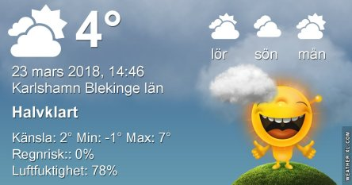
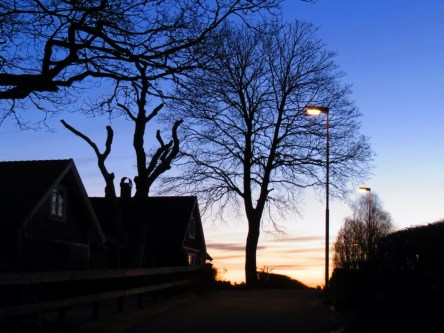

Idag går solen upp 05:56 och ned 18:19. Månen går upp 08:59 och ned 00:28 Månen är belyst 32 %. Dagens längd är 12 timmar och 23 minuter

 Molnigt - 0,6 C  Vindby 1 m/s N  Luftfuktighet 89 %  hPa 1002 Kl.01:55

 Molnigt - 0,6 C  Vindby 1,2 m/s ENE  Luftfuktighet 89 %  hPa 1003 Kl.07:05

 Halvklart 11,7 C  Vindby 2,6 m/s SSE  Luftfuktighet 54 %  hPa 1002 Kl.13:50

 Dimma  - 1,5 C  Vindby 1,4 m/s NNW  Luftfuktighet 86 %  hPa 1002 Kl.19:50

 Solen tittade fram idag men senare blev det grått med tät dimma.

Högst och lägst uppmätta temperatur igår (inofficiellt privat mätare): Max 5.6 C  , Min – 1,6 C Högst uppmätta vind 2 m/s. Högst uppmätta vindby 4,4 m/s.

Högst och lägst uppmätta temperatur igår (officiellt enligt [YR.NO](http://www.vackertvader.se/v%C3%A4derstation/karlshamn?utm_source=email&utm_medium=email&utm_campaign=asarum)) Max 3 C, Min – 0,3 C Högst uppmätta vind 2 m/s. Högst uppmätta vindby 4,1 m/s

 Det var en grå och tråkig morgon idag så jag tittar tillbaka på onsdagens soluppgång istället.
