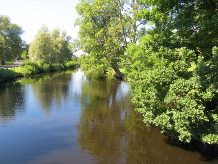

Idag går solen upp 04:33 och ned 21:21. Månen går upp 13:38 och ned 02:56 Månen är belyst 60 %. Dagens längd är 16 timmar och 48 minuter

 Växlande molnighet 7 C  Vindstilla  Luftfuktighet 96 %  hPa 1016 Kl.01:35

 Mest klart 21,4 C  Vindstilla  Luftfuktighet 61 %  hPa 1017 Kl.07:20

 Klart 28,2 C  Vindby 2,8 m/s ESE  Luftfuktighet 46 %  hPa 1020 Kl.14:10

 Halvklart 16,8 C  Vindby 0,7 m/s W  Luftfuktighet 61 %  hPa 1022 Kl.20:00

 Nu blir det varmare igen. Och inget regn i sikte.

Högst och lägst uppmätta temperatur igår (inofficiellt privat mätare): Max 25,9 C ( i solen) , Min 5,6 C Högst uppmätta vind 1,4 m/s. Högst uppmätta vindby 4,8 m/s.

Högst och lägst uppmätta temperatur igår (officiellt enligt [YR.NO](http://www.vackertvader.se/v%C3%A4derstation/karlshamn?utm_source=email&utm_medium=email&utm_campaign=asarum)) Max 21,4 C, Min 4,2 C Högst uppmätta vind 3,8 m/s. Högst uppmätta vindby 6,6 m/s

 Lite bilder från Ronneby från arkivet.
