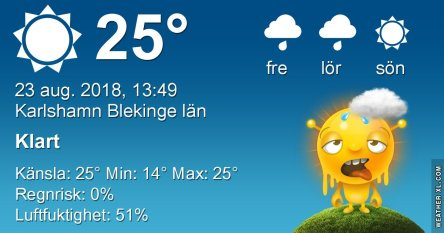
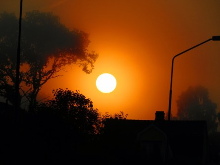
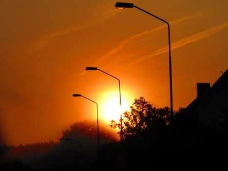

Idag går solen upp 05:46 och ned 20:19. Dagens längd är 14 timmar och 33 minuter. Det är gryning 05:05 och skymning 21:00 Det är dagsljus 15 timmar och 55 minuter. Månen går upp 19:15 och ned 02:08 Månen är belyst 90 %.

 Mest klart 10,3 C  Vindstilla Luftfuktighet 97 %  hPa 1011 Kl.02:00

 Halvklart 14,9 C  Vindstilla  Luftfuktighet 92 %  hPa 1009 Kl.07:35

 Tunna slöjmoln 30,3 C  Vindby 2,4 m/s SE  Luftfuktighet 41 %  hPa 1007 Kl.13:50

 Växlande molnighet 18,8 C  Vindby 0,8 m/s SSW  Luftfuktighet 79 %  hPa 1004 Kl.20:05

 Ännu en kvalmigt varm dag utan regn.

Högst och lägst uppmätta temperatur igår (inofficiellt privat mätare): Max 27,6 C ( i solen ), Min 5,7 C Högst uppmätta vind 2,7 m/s. Högst uppmätta vindby 5,8 m/s

Högst och lägst uppmätta temperatur igår (officiellt enligt [YR.NO](http://www.vackertvader.se/v%C3%A4derstation/karlshamn?utm_source=email&utm_medium=email&utm_campaign=asarum)) Max 21,3 C, Min 5,8 C Högst uppmätta vind 4 m/s. Högst uppmätta vindby 8,8 m/s

 Idag var soluppgången helt fantastisk med dis och dimma och en nästan helt molnfri himmel. Även om jag helst vill slippa se solen ett bra tag framöver så är det svårt att inte bli imponerad av hur vackert det är när den går upp.
