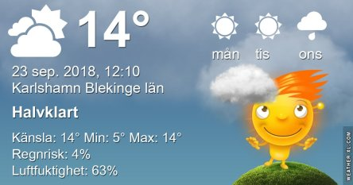
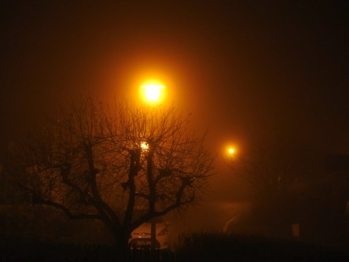
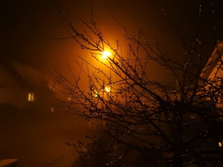
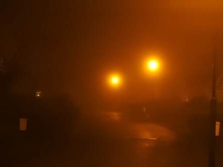
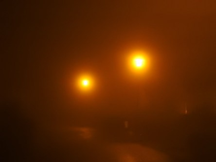

Idag går solen upp 06:47 och ned 18:57. Dagens längd är 12 timmar och 10 minuter. Det är gryning 06:10 och skymning 19:35 Det är dagsljus 13 timmar och 25 minuter. Månen går upp 18:59 och ned 04:13 Månen är belyst 96 %.

 Växlande molnighet 8,4 C  Vindby 4,1 m/s E  Luftfuktighet 83 %  hPa 1003 Kl.01:20

 Växlande molnighet 10 C  Vindby 2,4 m/s SSE  Luftfuktighet 88 %  hPa 1002 Kl.07:05

 Växlande molnighet och blåsigt 19 C  Vindby 4,2 m/s NNE  Luftfuktighet 45 %  hPa 1002 Kl.13:15

 Halvklart 7 C  Vindby 0,6 m/s SW  Luftfuktighet 84 % hPa 1001 Kl.19:45

 Nu är det verkligen höstkänsla i luften, hög och klar luft. Riktigt skönt nu med lagom med sol och kalla nätter.

Högst och lägst uppmätta temperatur igår (inofficiellt privat mätare): Max 17,2 C , Min 7,7 C Högst uppmätta vind 5,8 m/s. Högst uppmätta vindby 7,5 m/s

Högst och lägst uppmätta temperatur igår (officiellt enligt [YR.NO](http://www.vackertvader.se/v%C3%A4derstation/karlshamn?utm_source=email&utm_medium=email&utm_campaign=asarum)) Max 15,3 C, Min 7,4 C Högst uppmätta vind 3,9 m/s. Högst uppmätta vindby 10,9 m/s

 Ur arkivet: En väldigt dimmig kväll här på gatan. Jag tycker effekten med gatlamporna blev väldigt snyggt.
