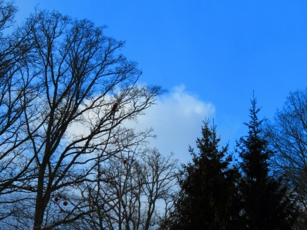
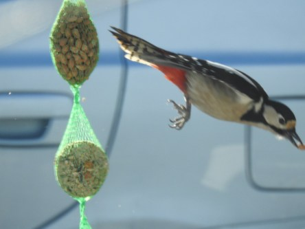

Idag går solen upp 07:06 och ned 17:22. Månen går upp 11:00 och ned 02:36 Månen är belyst 58 %. Dagens längd är 10 timmar och 16 minuter

 Klart - 6,7 C  Vindby 2,2 m/s WSW  Luftfuktighet 76 %  hPa 1028 Kl.02:30

 Klart - 8,6 C  Vindby 2,4 m/s SSW  Luftfuktighet 79 %  hPa 1030 Kl.06:30

 Växlande molnighet 3,3 C  Vindby 4,8 m/s SSW  Luftfuktighet 51 %  hPa 1032 Kl.13:40

 Halvklart - 7,5 C  Vindby 2 m/s NNW  Luftfuktighet 67 %  hPa 1032 Kl.19:45

 Äntligen visade sig solen igen. Och med hjälp av den kröp det upp i några plusgrader idag.

Högst och lägst uppmätta temperatur igår (inofficiellt privat mätare): Max 2,5 C, Min – 10,4 C Högst uppmätta vind 2 m/s. Högst uppmätta vindby 3,7 m/s.

Högst och lägst uppmätta temperatur igår (officiellt enligt [YR.NO](http://www.vackertvader.se/v%C3%A4derstation/karlshamn?utm_source=email&utm_medium=email&utm_campaign=asarum)) Max – 1,1 C, Min – 10,4 C Högst uppmätta vind 3,7 m/s. Högst uppmätta vindby 7,6 m/s

 Äntligen en blå himmel och lite sol igen.

 Och min vän Hacke var här på blixtvisit innan hon flög sin kos igen.
