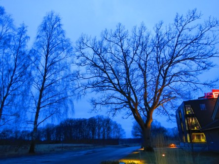
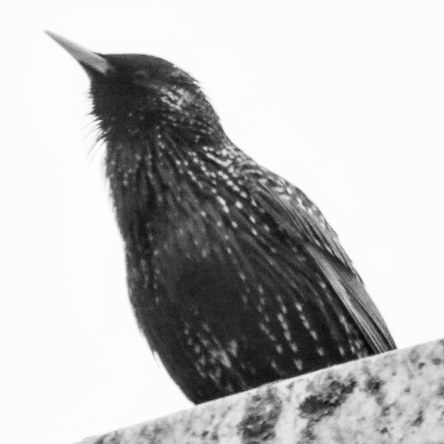

Idag går solen upp 05:53 och ned 18:21. Månen går upp 09:43 och ned 01:41 Månen är belyst 43 %. Dagens längd är 12 timmar och 28 minuter

 Molnigt - 1,2 C  Vindby 0,3 m/s NNW  Luftfuktighet 95 %  hPa 1001 Kl.01:45

 Molnigt - 0,5 C   Vindstilla  Luftfuktighet 83 %  hPa 1001 Kl.06:35

 Molnigt 4,6 C   Vindby 2,4 m/s NNW  Luftfuktighet 64 %  hPa 1002 Kl.14:00

 Molnigt 1 C  Vindby 0,6 m/s S  Luftfuktighet 78 %  hPa 1002 Kl.19:50

 Tröttsamt grått och tråkigt igen.

Högst och lägst uppmätta temperatur igår (inofficiellt privat mätare): Max 12,3 C ( i solen ) , Min – 2,1 C Högst uppmätta vind 2,4 m/s. Högst uppmätta vindby 3,4 m/s.

Högst och lägst uppmätta temperatur igår (officiellt enligt [YR.NO](http://www.vackertvader.se/v%C3%A4derstation/karlshamn?utm_source=email&utm_medium=email&utm_campaign=asarum)) Max 5,5 C, Min – 1,3 C Högst uppmätta vind 3,3 m/s. Högst uppmätta vindby 6,2 m/s

 Tidig morgon en mulen dag i Asarum.

 En suddig oskarp och allt annat än en bra bild. Men ändå: Årets första stare. I alla fall som jag har sett. Ett vårtecken så gott som något.
