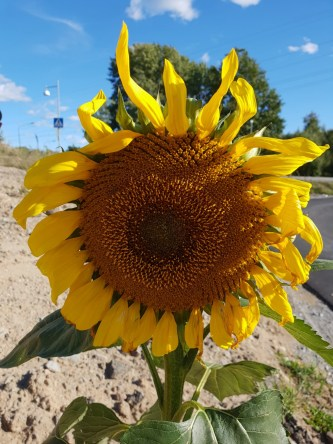
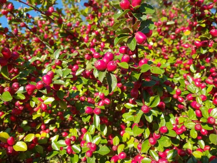
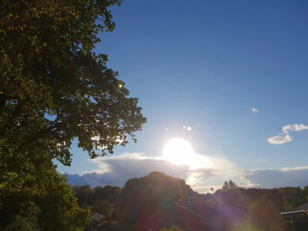
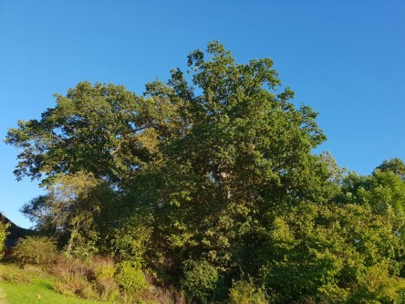
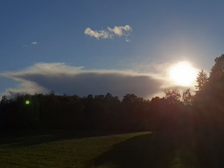
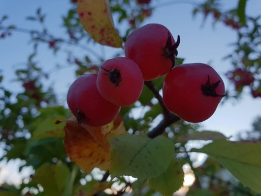
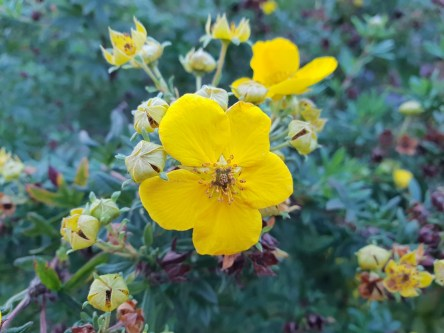

Idag går solen upp 06:49 och ned 18:55. Dagens längd är 12 timmar och 06 minuter. Det är gryning 06:12 och skymning 19:32 Det är dagsljus 13 timmar och 20 minuter. Månen går upp 19:16 och ned 05:25 Månen är belyst 99 %.

 Enstaka moln 3,1 C  Vindby 0,8 m/s NNW  Luftfuktighet 99 %  hPa 1003 Kl.02:25

 Mest klart 2,4 C  Vindby 0,7 m/s N  Luftfuktighet 99 %  hPa 1006 Kl.06:30

 En del små moln 18,2 C  Vindby 4,2 m/s WSW  Luftfuktighet 28 %  hPa 1013 Kl.14:00

 Mest klart 5,6 C  Vindby 1,6 m/s N  Luftfuktighet 61 %  hPa 1017 Kl.20:00

 Nu är det så kallt så att man fryser och behöver jacka på kvällarna.

Högst och lägst uppmätta temperatur igår (inofficiellt privat mätare): Max 19,4 C , Min 3,8 C Högst uppmätta vind 4,1 m/s. Högst uppmätta vindby 7,1 m/s

Högst och lägst uppmätta temperatur igår (officiellt enligt [YR.NO](http://www.vackertvader.se/v%C3%A4derstation/karlshamn?utm_source=email&utm_medium=email&utm_campaign=asarum)) Max 15,4 C, Min 3,2 C Högst uppmätta vind 4 m/s. Högst uppmätta vindby 12,5 m/s

 Lite sensommarbilder från idag. Nu är det inte mycket kvar som blommar.
