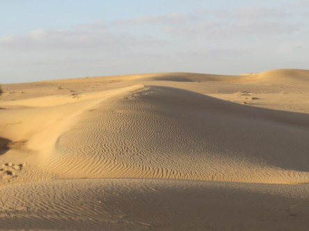

Idag går solen upp 08:09 och ned 16:17. Månen går upp 11:23 och ned 00:55 Månen är belyst 51 %. Dagens längd är 8 timmar och 8 minuter

 Molnigt 7,1 C  Vindby 3,1 m/s NW  Luftfuktighet 97 %  hPa 996  Regn 0,5 mm Kl.02:15

 Molnigt 5,7 C  Vindby 4,4 m/s N  Luftfuktighet 84 %  hPa 999 Kl.07:25

 Molnigt 7,4 C  Vindby 3,4 m/s ESE  Luftfuktighet 73 %  hPa 1003 Kl.14:40

 Halvklart 3,3 C  Vindby 2,2 m/s ENE  Luftfuktighet 92 %  hPa 1006 Kl.20:00

 Jag är trött på grått, trött på kyla och trött på mörker. Kort sagt: Jag längtar till våren.

Högst och lägst uppmätta temperatur igår (inofficiellt privat mätare): Max 8,7 C , Min 2,9 C Högst uppmätta vind 5,8 m/s. Högst uppmätta vindby 9,2 m/s.

Högst och lägst uppmätta temperatur igår (officiellt enligt [YR.NO](http://www.vackertvader.se/v%C3%A4derstation/karlshamn?utm_source=email&utm_medium=email&utm_campaign=asarum)) Max 7,7 C, Min 2,9 C Högst uppmätta vind 4,2 m/s. Högst uppmätta vindby 11,4 m/s

 Jag fortsätter att minnas och drömma mig tillbaks till bättre ställen att vara på just nu. Det här är bilder från vår ökensafari i Dubai. jag önskar att jag vore där nu.
