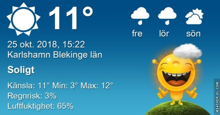
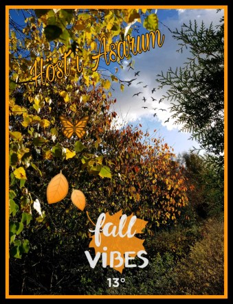
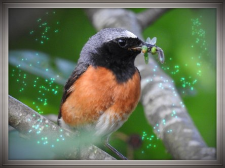
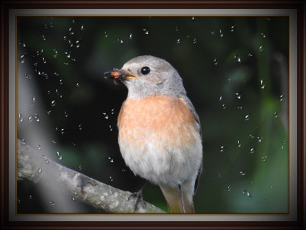

Idag går solen upp 07:53 och ned 17:36. Dagens längd är 9 timmar och 43 minuter. Det är gryning 07:14 och skymning 18:14 Det är dagsljus 11 timmar och 0 minuter. Månen går upp 18:33 och ned 08:10 Månen är belyst 100 %.

 Molnigt 4,7 C  Vindby 1,4 m/s ESE  Luftfuktighet 86 %   hPa 1001 Kl.02:00

 Molnigt 8,7 C  Vindby 2,4 m/s NW  Luftfuktighet 91 %  hPa 995  Regn 0,8 mm Kl.07:40

 Växlande molnighet 16,6 C  Vindby 4,8 m/s ENE  Luftfuktighet 48 %  hPa 995 Kl.14:00

 Mest molnigt 3,9 C  Vindby 0,3 m/s NW  Luftfuktighet 83 %  hPa 999 Kl.08:05

 Soligt och klar luft. Och till och med lite regn inatt.

Högst och lägst uppmätta temperatur igår (inofficiellt privat mätare): Max 13,8 C , Min 0,9 C Högst uppmätta vind 4,1 m/s, Högst uppmätta vindby 5,8 m/s

Högst och lägst uppmätta temperatur igår (officiellt enligt [YR.NO](http://www.vackertvader.se/v%C3%A4derstation/karlshamn?utm_source=email&utm_medium=email&utm_campaign=asarum)) Max 8,7 C, Min 2,7 C Högst uppmätta vind 4,9 m/s. Högst uppmätta vindby 12,2 m/s

 Snart har de sista höstlöven fallit.

 Pappa och mamma rödstjärt med godis till de små.

 Pappa Hacke har också hittat godis till sina små.
