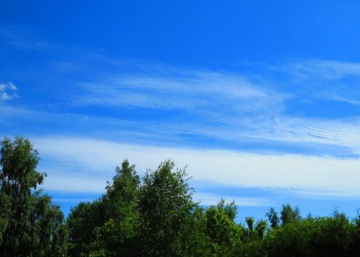
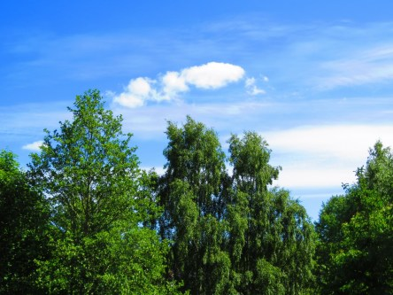
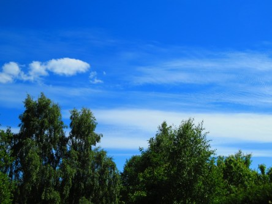
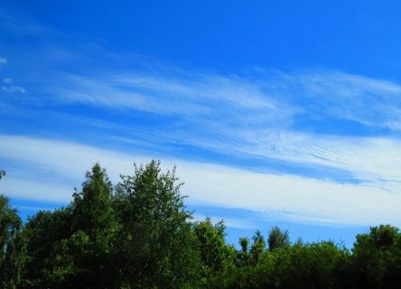

Idag går solen upp 04:30 och ned 21:25. Månen går upp 16:14 och ned 03:34 Månen är belyst 80 %. Dagens längd är 16 timmar och 55 minuter

 Klart 6,3 C  Vindstilla  Luftfuktighet 99 %  hPa 1024 Kl.01:40

 Mest klart 17,6 C  Vindby 1 m/s W  Luftfuktighet 45 %  hPa 1023 Kl.07:25

 Växlande molnighet 27,7 C  Vindby 6 m/s ENE  Luftfuktighet 40 %  hPa 1021 Kl.14:15

 Halvklart 19,7 C  Vindby 2,6 m/s NE  Luftfuktighet 50 %  hPa 1021 Kl.20:10

 Nu vill jag ha regn. Solen kan gott ta semester ett tag nu.

Högst och lägst uppmätta temperatur igår (inofficiellt privat mätare): Max 29,2 C ( i solen) , Min 5,3 C Högst uppmätta vind ? m/s. Högst uppmätta vindby 3,4 m/s ? ( trasig vindmätare. Inväntar ny )

Högst och lägst uppmätta temperatur igår (officiellt enligt [YR.NO](http://www.vackertvader.se/v%C3%A4derstation/karlshamn?utm_source=email&utm_medium=email&utm_campaign=asarum)) Max 22,6 C, Min 4,2 C Högst uppmätta vind 4,4 m/s. Högst uppmätta vindby 7,6 m/s

 Härliga sommarfärger med blå himmel, vita moln och gröna träd.
