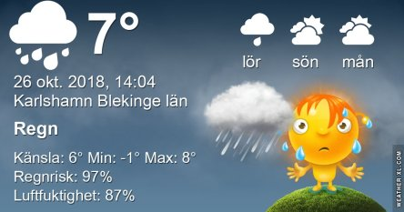
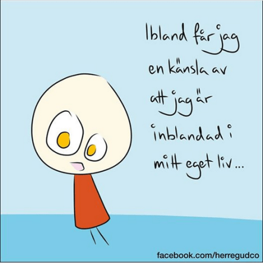

Idag går solen upp 07:55 och ned 17:33. Dagens längd är 9 timmar och 38 minuter. Det är gryning 07:16 och skymning 18:12 Det är dagsljus 10 timmar och 56 minuter. Månen går upp 18:58 och ned 09:30 Månen är belyst 98 %.

 Tunna böljemoln - 2,3 C  Vindstilla  Luftfuktighet 88 %  hPa 1000 Kl.01:55

 Molnigt 2,2 C  Vindby 0,3 m/s SW  Luftfuktighet 95 %  hPa 999 Kl.07:00

 Regn 9,1 C  Vind0,4 m/s SW  Luftfuktighet 88 %  hPa 997  Regn 1,5 mm Kl.14:05

 Lätt regn 5,8 C  Vindby 0,7 m/s W  Luftfuktighet 94 %  hPa 992  Regn 6,2 mm Kl.19:50

 Idag har det kommit lite regn igen. Men bara lite!

Högst och lägst uppmätta temperatur igår (inofficiellt privat mätare): Max 16,6 C , Min - 0,7 C Högst uppmätta vind ? m/s, Högst uppmätta vindby ? m/s

Högst och lägst uppmätta temperatur igår (officiellt enligt [YR.NO](http://www.vackertvader.se/v%C3%A4derstation/karlshamn?utm_source=email&utm_medium=email&utm_campaign=asarum)) Max 13,1 C, Min - 1,5 C Högst uppmätta vind 4,8 m/s. Högst uppmätta vindby 11,2 m/s

 Två nya tavlor av gamla bilder.

 Och några kloka ord igen.
