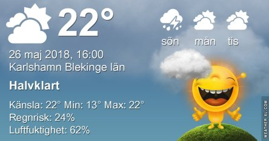
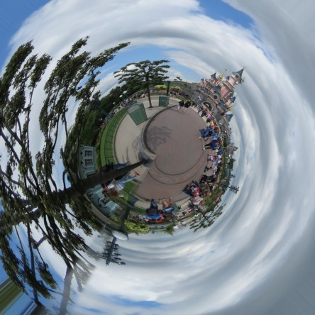

Idag går solen upp 04:29 och ned 21:26. Månen går upp 17:30 och ned 03:52 Månen är belyst 88 %. Dagens längd är 16 timmar och 57 minuter

 Klart 12,1 C  Vindby 1,4 m/s SE  Luftfuktighet 73 %  hPa 1021 Kl.01:40

 Växlande molnighet 20,3 C  Vindby 1 m/s SSE  Luftfuktighet 62 %  hPa 1020 Kl.07:20

 Lätt regn 20,7 C  Vindby 3,7 m/s S  Luftfuktighet 76 %  hPa 1022 Kl.13:15

 Mörka moln 20,6 C  Vindby 2 m/s SSW  Luftfuktighet 75 %  hPa 1021 Kl.19:45

 Idag kom det några regnstänk. Hoppas på mer.

Högst och lägst uppmätta temperatur igår (inofficiellt privat mätare): Max 28,4 C ( i solen) , Min 4,8 C Högst uppmätta vind 2,4 m/s. Högst uppmätta vindby 4,1 m/s ? ( trasig vindmätare. Inväntar ny )

Högst och lägst uppmätta temperatur igår (officiellt enligt [YR.NO](http://www.vackertvader.se/v%C3%A4derstation/karlshamn?utm_source=email&utm_medium=email&utm_campaign=asarum)) Max 24,2 C, Min 4,5 C Högst uppmätta vind 3,8 m/s. Högst uppmätta vindby 9 m/s

 Idag roade jag mig med att göra små "tiny planets" av lite bilder från Disney World i Paris.
