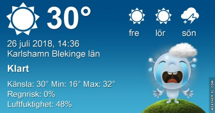
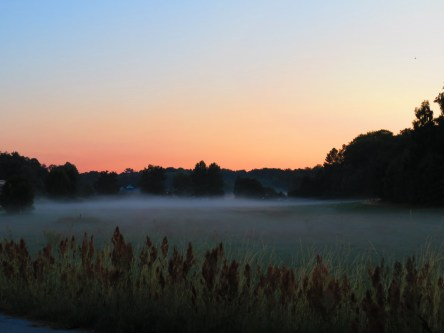
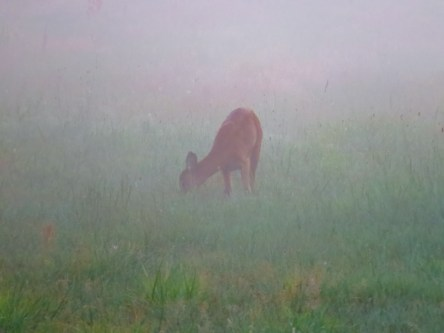
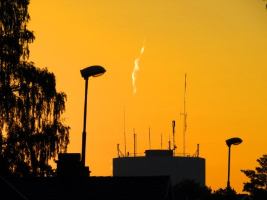

Idag går solen upp 04:52 och ned 21:21. Dagens längd är 16 timmar och 29 minuter. Det är gryning 04:00 och skymning 22:12 Det är dagsljus 18 timmar och 12 minuter. Månen går upp 20:37 och ned 03:17 Månen är belyst 97 %.

 Halvklart 17,8 C  Vindby 0,3 m/s W  Luftfuktighet 96 %  hPa 1013 Kl.02:30

 Mest klart 20,9 C  Vindby 0,8 m/s W  Luftfuktighet 64 %  hPa 1014 Kl.07:05

 Klart 33,5 C  Vindby 2,7 m/s S  Luftfuktighet 50 %  hPa 1015 Kl.14:05

 Klart 24,6 C  Vindby 1,6 m/s SSW  Luftfuktighet 56 %  hPa 1015 Kl.20:00

 Allt är sagt, som Anki på Ankis Bildblogg skrev i en kommentar. Så det är bara att försöka stå ut. För vad har man för val?

Högst och lägst uppmätta temperatur igår (inofficiellt privat mätare): Max 35,1 C ( i solen ), Min 14,8 C Högst uppmätta vind 2,7 m/s. Högst uppmätta vindby 4,7 m/s

Högst och lägst uppmätta temperatur igår (officiellt enligt [YR.NO](http://www.vackertvader.se/v%C3%A4derstation/karlshamn?utm_source=email&utm_medium=email&utm_campaign=asarum)) Max 27,3 C, Min 14,2 C Högst uppmätta vind 4,3 m/s. Högst uppmätta vindby 7,5 m/s

 Dimman låg tät på sina ställen på morgonen.

 Rådjuret betar på samma ställe varje morgon. Idag var det inte så lätt att se det i dimman.

 Men lite senare var dimman ett minne blott och solen tog över igen!
