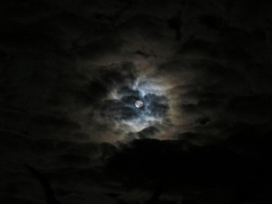

Idag går solen upp 05:52 och ned 20:11. Dagens längd är 14 timmar och 19 minuter. Det är gryning 05:11 och skymning 20:52 Det är dagsljus 15 timmar och 41 minuter. Månen går upp 20:25 och ned 05:17 Månen är belyst 100 %.

 Växlande molnighet 7,7 C  Vindstilla  Luftfuktighet 99 %  hPa 1003 Kl.01:25

 Växlande molnighet 4,2 C  Vindby 0,3 m/s NW  Luftfuktighet 98 %  hPa 1004 Kl.06:00

 Växlande molnighet 24,9 C  Vindby 2,4 m/s SW  Luftfuktighet 39 %  hPa 1006 Kl.13:20

 Mest klart 13,4 C  Vindby 0,3 m/s W  Luftfuktighet 68 %  hPa 1008  Regn 0,5 mm Kl.19:50

 Äntligen är dagarna lite svalare och idag har det varit blåsigt och ganska mycket moln.

Högst och lägst uppmätta temperatur igår (inofficiellt privat mätare): Max 23,2 C ( i solen ), Min 6,9 C Högst uppmätta vind 3,7 m/s. Högst uppmätta vindby 7,1 m/s

Högst och lägst uppmätta temperatur igår (officiellt enligt [YR.NO](http://www.vackertvader.se/v%C3%A4derstation/karlshamn?utm_source=email&utm_medium=email&utm_campaign=asarum)) Max 19,1 C, Min 6,8 C Högst uppmätta vind 3,9 m/s. Högst uppmätta vindby 8,8 m/s

 Inatt var det fullmåne och mycket moln. Väldigt vackert.
