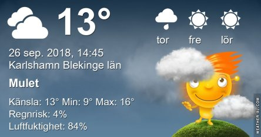
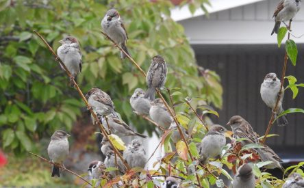
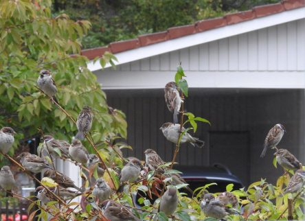
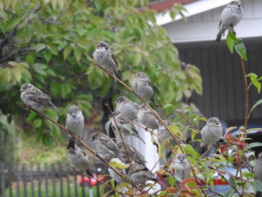

Idag går solen upp 06:53 och ned 18:49. Dagens längd är 11 timmar och 56 minuter. Det är gryning 06:16 och skymning 19:27 Det är dagsljus 13 timmar och 11 minuter. Månen går upp 19:50 och ned 07:53 Månen är belyst 99 %.

 Halvklart 6,7 C  Vindby 1,7 m/s E  Luftfuktighet 88 %  hPa 1025 Kl.02:15

 Molnigt 10,1 C  Vindby 5,4 m/s S  Luftfuktighet 80 %  hPa 1020 Kl.06:50

 Molnigt 14,2 C  Vindby 4,2 m/s S  Luftfuktighet 78 %  hPa 1012 Kl.14:15

 Blåsigt och molnigt 13,6 C  Vindby 5,6 m/s SE  Luftfuktighet 86 %  hPa 1010  Regn 0,5 mm Kl.19:50

 Idag har det varit blåsigt och lite regnstänk.

Högst och lägst uppmätta temperatur igår (inofficiellt privat mätare): Max 19,4 C , Min - 2,2 C Högst uppmätta vind 3,1 m/s. Högst uppmätta vindby 4,4 m/s

Högst och lägst uppmätta temperatur igår (officiellt enligt [YR.NO](http://www.vackertvader.se/v%C3%A4derstation/karlshamn?utm_source=email&utm_medium=email&utm_campaign=asarum)) Max 14,7 C, Min - 1,6 C Högst uppmätta vind 3,8 m/s. Högst uppmätta vindby 9,6 m/s

 Det växer gråsparvar och pilfinkar i mitt träd!
