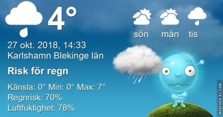
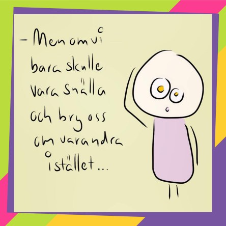

Idag går solen upp 07:57 och ned 17:31. Dagens längd är 9 timmar och 34 minuter. Det är gryning 07:18 och skymning 18:10 Det är dagsljus 10 timmar och 52 minuter. Månen går upp 19:29 och ned 10:50 Månen är belyst 93 %.

 Mest molnigt 4,5 C  Vindby 0,8 m/s N  Luftfuktighet 95 %  hPa 989  Regn 1,2 mm Kl.02:00

 Regn 2,7 C  Vindby 2 m/s SSW  Luftfuktighet 95 %  hPa 989 Kl.07:20

 Molnigt 6,4 C  Vindby 5 m/s W  Luftfuktighet 74 %  hPa 997  Regn 3,4 mm Kl.13:50

 Mest klart - 2,4 C  Vindby 0,6 m/s SW  Luftfuktighet 82 %  hPa 1007  Regn 3,5 mm Kl.21:45

 Lite mer regn inatt och kallt hela dagen.

Högst och lägst uppmätta temperatur igår (inofficiellt privat mätare): Max 9,5 C , Min – 2,3 C Högst uppmätta vind 1,7 m/s, Högst uppmätta vindby 2,4 m/s

Högst och lägst uppmätta temperatur igår (officiellt enligt [YR.NO](http://www.vackertvader.se/v%C3%A4derstation/karlshamn?utm_source=email&utm_medium=email&utm_campaign=asarum)) Max 8,2 C, Min – 1,4 C Högst uppmätta vind 2,4 m/s. Högst uppmätta vindby 6,1 m/s

 Några kloka ord som fått ramar.
