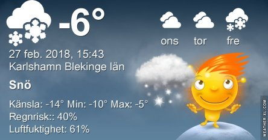
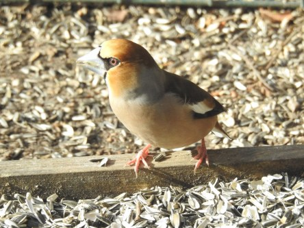
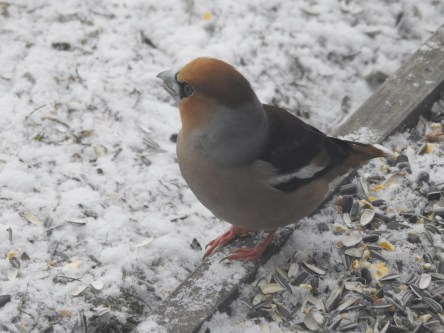
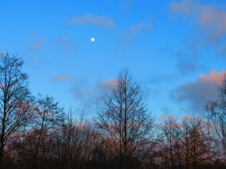

Idag går solen upp 06:58 och ned 17:29. Månen går upp 14:04 och ned 05:41 Månen är belyst 88 %. Dagens längd är 10 timmar och 31 minuter

 Mest klart och kallt - 8,7 C  Vindby 1,6 m/s NNW  Luftfuktighet 74 %  hPa 1024 Kl.02:05

 Molnigt och lite snö - 8,4 C  Vindby 4,2 m/s NNW  Luftfuktighet 69 %  hPa 1022 Kl.06:50

 Blåsigt - 4 C  Vindby 10,5 m /s E  Luftfuktighet 54 %  hPa 1025 Kl.13:35

 Lätt snö - 10,7 C  Vindby 5,2 m/s ENE  Luftfuktighet 71 %  hPa 1029 Kl.19:50

 Idag har det inte varit någon solskenshistoria direkt. Blåsigt, kallt och snöbyar.

Högst och lägst uppmätta temperatur igår (inofficiellt privat mätare): Max 2,8 C ( i solen ), Min – 9,3 C Högst uppmätta vind 1,4 m/s. Högst uppmätta vindby 8 m/s.

Högst och lägst uppmätta temperatur igår (officiellt enligt [YR.NO](http://www.vackertvader.se/v%C3%A4derstation/karlshamn?utm_source=email&utm_medium=email&utm_campaign=asarum)) Max – 1,4 C, Min – 8 C Högst uppmätta vind 4 m/s. Högst uppmätta vindby 10 m/s

 Igår

 Idag

 Men man gick inte helt lottlös förbi idag trots allt. Lite blå himmel visade sig till slut.

 Och en tidig måne visade sig också.
