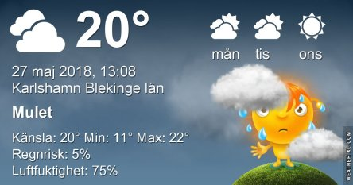
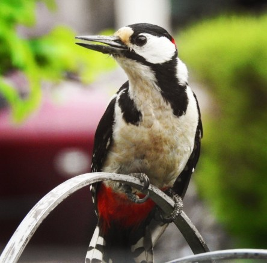
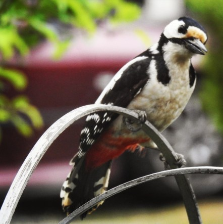
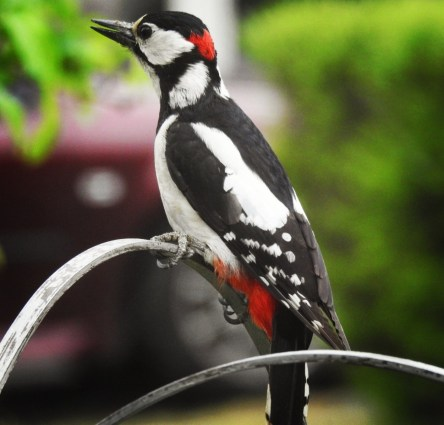
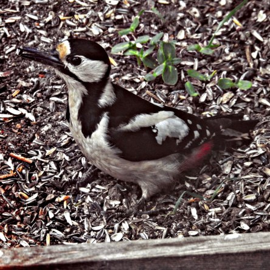

Idag går solen upp 04:27 och ned 21:28. Månen går upp 18:44 och ned 04:11 Månen är belyst 94 %. Dagens längd är 17 timmar och 1 minut

 Växlande molnighet 11,6 C  Vindstilla  Luftfuktighet 99 %  hPa 1021 Kl.01:25

 Molnigt 15,4 C  Vindby 1,6 m/s NE  Luftfuktighet 93 %  hPa 1020 Kl.07:15

 Mest molnigt 22,3 C  Vindby 3,4 m/s SSE  Luftfuktighet 87 %  hPa 1022  Regn 1,7 mm Kl.13:15

 Växlande molnighet 19 C  Vindby 2,6 m/s SSE  Luftfuktighet 59 %  hPa 1021 Kl.19:50

 Idag kom det några droppar regn. Men mycket mer behövs.

Högst och lägst uppmätta temperatur igår (inofficiellt privat mätare): Max 26,7 C ( i solen) , Min 11,6 C Högst uppmätta vind 2,4 m/s. Högst uppmätta vindby 4,4 m/s

Högst och lägst uppmätta temperatur igår (officiellt enligt [YR.NO](http://www.vackertvader.se/v%C3%A4derstation/karlshamn?utm_source=email&utm_medium=email&utm_campaign=asarum)) Max 22,3 C, Min 10,9 C Högst uppmätta vind 3,5 m/s. Högst uppmätta vindby 8 m/s

 Både pappa och mamma Hacke har fullt upp med sina hungriga småhackar just nu. Det blir många besök vid matbordet varje dag. Här är några bilder på pappa Hacke från idag. Mamma hann jag tyvärr inte få några bilder på den här gången. Nu hoppas jag på att de kommer och visar upp de små Hackarna när de är flygfärdiga.
