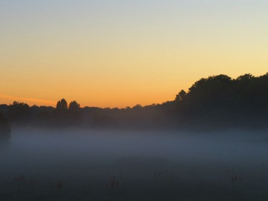
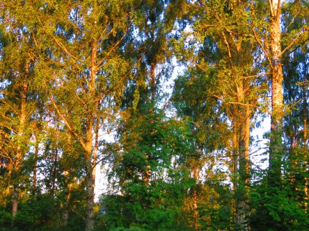
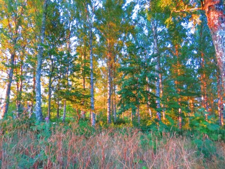

Idag går solen upp 04:54 och ned 21:19. Dagens längd är 16 timmar och 25 minuter. Det är gryning 04:03 och skymning 22:10 Det är dagsljus 18 timmar och 07 minuter. Månen går upp 21:15 och ned 04:11 Månen är belyst 99 %.

 Klart 16,3 C  Vindstilla  Luftfuktighet 95 %  hPa 1017 Kl.02:00

 Klart 20,3 C  Vindby 2 m/s ENE  Luftfuktighet 77 %  hPa 1017 Kl.06:55

 Klart 35 C  Vindby 5,2 m/s ENE  Luftfuktighet 41 %  hPa 1016 Kl.14:30

 Växlande molnighet 26,2 C  Vindby 3,7 m/s SW  Luftfuktighet 46 %  hPa 1014 Kl.19:55

 Jag känner mig lika sönderbränd som gräsmattan just nu.

Högst och lägst uppmätta temperatur igår (inofficiellt privat mätare): Max 34,7 C ( i solen ), Min 15,5 C Högst uppmätta vind 2,7 m/s. Högst uppmätta vindby 4,1 m/s

Högst och lägst uppmätta temperatur igår (officiellt enligt [YR.NO](http://www.vackertvader.se/v%C3%A4derstation/karlshamn?utm_source=email&utm_medium=email&utm_campaign=asarum)) Max 29,7 C, Min 15,3 C Högst uppmätta vind 3,6 m/s. Högst uppmätta vindby 7,2 m/s

 Dagen började med tät dimma igen. Väldigt vackert.

 När solen lyste bland träden såg det ut som guld som glimmade.
