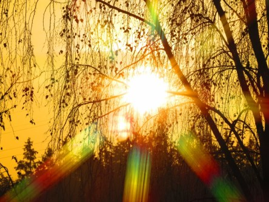
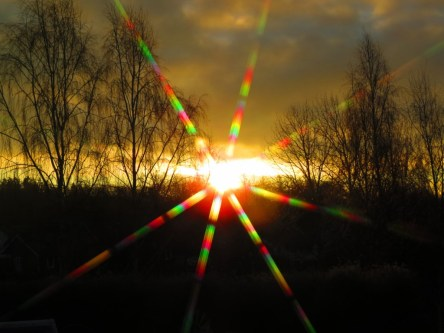
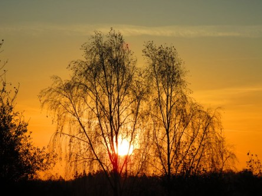
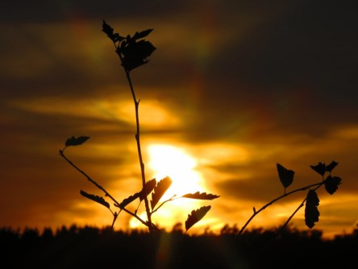
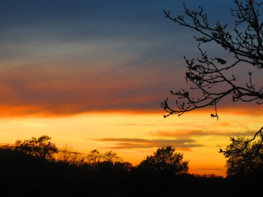
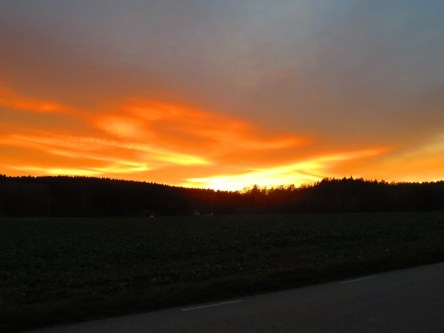

Idag går solen upp 06:55 och ned 18:47. Dagens längd är 11 timmar och 52 minuter. Det är gryning 06:18 och skymning 19:24 Det är dagsljus 13 timmar och 06 minuter. Månen går upp 20:09 och ned 09:09 Månen är belyst 96 %.

 Växlande molnighet 12,5 C  Vindby 4,8 m/s SE  Luftfuktighet 73 %  hPa 1013 Kl.02:00

 Växlande molnighet 10 C  Vindby 0,8 m/s ESE  Luftfuktighet 82 %  hPa 1014 Kl.07:45

 Molnigt 17,9 C  Vindby 4 m/s SSE  Luftfuktighet 76 %  hPa 1013 Kl.13:35

 Molnigt och blåsigt 15,7 C  Vindby 4,2 m/s SSE  Luftfuktighet 81 %  hPa 1006 Kl.19:55

 Mörka moln men inget regn, suck!

Högst och lägst uppmätta temperatur igår (inofficiellt privat mätare): Max 16,7 C , Min 5,9 C Högst uppmätta vind 5,8 m/s. Högst uppmätta vindby 9,2 m/s

Högst och lägst uppmätta temperatur igår (officiellt enligt [YR.NO](http://www.vackertvader.se/v%C3%A4derstation/karlshamn?utm_source=email&utm_medium=email&utm_campaign=asarum)) Max 15,5 C, Min 8,4 C Högst uppmätta vind 4,1 m/s. Högst uppmätta vindby 13,6 m/s

 När tid och ork tryter så är det bra med ett arkiv. Här är först ett försök med ett stjärnfilter som inte fick riktigt den effekt jag tänkt mig. Sen några bilder på solnedgångar.
