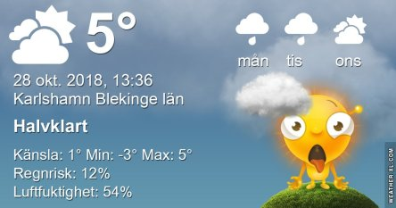

Idag går solen upp 06:59 och ned 16:29. Dagens längd är 9 timmar och 30 minuter. Det är gryning 06:20 och skymning 17:08 Det är dagsljus 10 timmar och 48 minuter. Månen går upp 20:11 och ned 12:06 Månen är belyst 87 %.

 Växlande molnighet - 3,8 C  Vindby 0,3 m/s SW  Luftfuktighet 88 %  hPa 1011 Kl.02:00

 Molnigt och första snön har kommit - 0,2 C  Vindby 2,7 m/s SSW  Luftfuktighet 79 %  hPa 1015 Kl.06:20

 Växlande molnighet 9,4 C  Vindby 3,6 m/s NE  Luftfuktighet 54 %  hPa 1018 Kl.13:55

 Halvklart - 1,1 C  Vindby 2,2 m/s NW  Luftfuktighet 75 %  hPa 1020 Kl.20:05

 Idag vaknade vi upp till vita tak och gräsmattor. Kung Bore hade tydligen vägarna förbi tidigt på morgonen!

Högst och lägst uppmätta temperatur igår (inofficiellt privat mätare): Max 6,8 C , Min – 3,8 C Högst uppmätta vind 3,1 m/s, Högst uppmätta vindby 7,2 m/s

Högst och lägst uppmätta temperatur igår (officiellt enligt [YR.NO](http://www.vackertvader.se/v%C3%A4derstation/karlshamn?utm_source=email&utm_medium=email&utm_campaign=asarum)) Max 5,1 C, Min – 3,1 C Högst uppmätta vind 4,5 m/s. Högst uppmätta vindby 10,2 m/s

 Jag ramade in och pyntade lite gamla soluppgångar i brist på annat idag.

 Ja, det kan man ju undra. Eller hur?

 Och ett vykort från New York.
