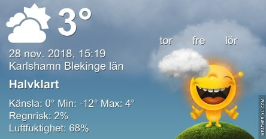
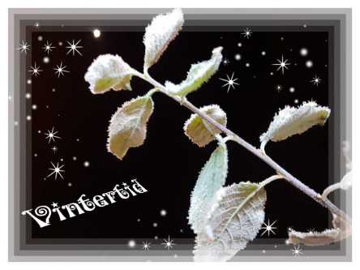

Idag går solen upp 08:03 och ned 15:33 Dagens längd är 7 timmar och 30 minuter. Det är gryning 07:18 och skymning 16:19 Det är dagsljus 9 timmar och 1 minut. Månen går upp 21:35 och ned 12:35 Månen är belyst 71 %.

 Klart - 11,2 C  Vindstilla  Luftfuktighet 74 %  hPa 1025 KL.02:10

 Ökande molnighet - 11,2 C  Vindstilla  Luftfuktighet 73 %  hPa 1027 KL.07:25

 Mest molnigt 1,6 C  Vindby 1,4 m/s N  Luftfuktighet 79 %  hPa 1026 KL.14:25

 Växlande molnighet 1,4 C  Vindby 4,2 m/s WNW  Luftfuktighet 60 %  hPa 1025 Kl.20:15

 Efter en riktigt kall period är värmen äntligen på väg tillbaks!

Högst och lägst uppmätta temperatur igår (inofficiellt privat mätare): Max 4,3 C , Min – 11,1 C Högst uppmätta vind 1,4 m/s, Högst uppmätta vindby 2 m/s

Högst och lägst uppmätta temperatur igår (officiellt enligt [YR.NO](http://www.vackertvader.se/v%C3%A4derstation/karlshamn?utm_source=email&utm_medium=email&utm_campaign=asarum)) Max - 0,2 C, Min – 11,7 C Högst uppmätta vind 2,4 m/s. Högst uppmätta vindby 4,4 m/s

\[gallery type="rectangular" link="file" size="medium" ids="25663,25664,25665"\]

Dagens kloka ord!

 Vintertid är förkylningstid. Ont i halsen och tröttare än trött. Inte så mycket på fotofronten att komma med. Men den här bilden från en iskall natt med svart himmel får duga idag.
